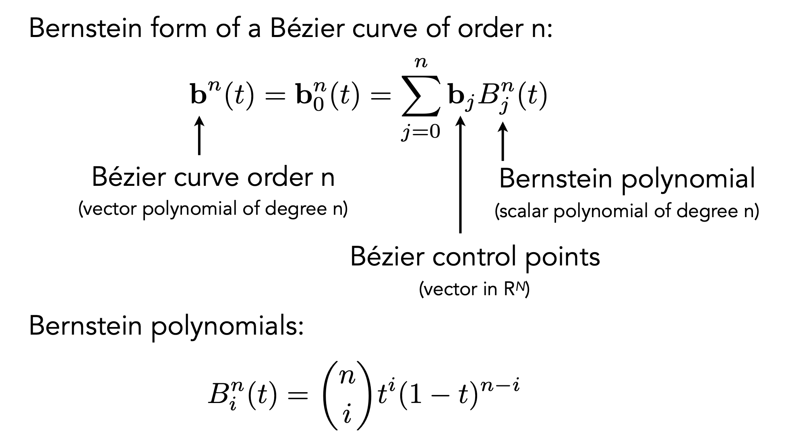

# 什么是 Geometry？
在计算机图形学中，**Geometry** 指的是描述三维物体形状和结构的几何数据，通常由一组**顶点**（Vertices）和**图元**（Primitives，如三角形、四边形、多边形）组成。顶点包含了物体的位置坐标 $(x, y, z)$，还可能附带法线（Normal）、纹理坐标 $(u, v)$、颜色等属性；图元则定义了顶点如何连接成面——最常用的是三角形，因为三角形具有平面性（三点确定一个平面）、简单性（易于光栅化）和稳定性（仿射变换下保持凸性）。几何数据可以来源于建模软件（如 Blender、Maya 导出的 .obj 或 .fbx 文件）、程序化生成（如通过算法创建地形网格或植被）、或者运行时计算（如粒子系统、曲面细分后的动态网格）。几何是整个图形渲染管线的输入源头，从顶点着色器对每个顶点进行 MVP 变换，到光栅化阶段将三角形拆分成像素，再到片段着色器计算每个像素的颜色，所有后续步骤都依赖于几何的质量和复杂度。高精度的几何（如数百万个三角形）能表现细腻的细节（如角色的面部皱纹、盔甲的花纹），但会带来更高的存储开销和计算负载；低精度的几何（如数百个三角形）则渲染速度快，但需要配合法线贴图、位移贴图等技巧来弥补视觉上的不足。因此，几何数据的优化（如 LOD、剔除、实例化）是实时渲染性能优化的核心方向之一。

# Implicit 和 Explicit 分别是什么？
在计算机图形学中，**Implicit**（隐式表示）和**Explicit**（显式表示）是描述几何形状和曲面的两种基本方式，其核心区别在于如何定义点是否属于表面上。**隐式表示**通过一个方程或不等式来定义表面，形式为 $F(x, y, z) = 0$，即所有满足该方程的点 $(x, y, z)$ 构成表面，而 $F(x, y, z) > 0$ 和 $F(x, y, z) < 0$ 分别表示外部和内部。例如，球体的隐式表示为 $x^2 + y^2 + z^2 - R^2 = 0$。隐式表示的优点在于容易判断点是否在表面上（只需带入方程）以及进行布尔运算（并、交、差），但缺点是不容易直接生成表面的点集，且难以处理复杂的拓扑结构。

**显式表示**则直接给出了表面的点集或参数化形式，最典型的是**多边形网格**（如三角形网格）——直接列出所有顶点的坐标和连接关系；另一种显式形式是**参数曲面**，如 $f(u, v) = (x(u, v), y(u, v), z(u, v))$，通过两个参数 $(u, v)$ 直接生成表面上的点。显式表示的优点是易于绘制和光栅化（因为直接提供了顶点和面），且支持复杂细节和纹理映射，缺点则是判断点是否在表面内部需要解算且通常计算较慢，同时存储和传输大体积的网格数据可能消耗较多资源。

在图形学实践中，建模软件常用隐式表示（如 CSG，Constructive Solid Geometry 构造实体几何）来设计物体，但最终渲染阶段几乎都转换为显式的三角形网格（即显式表示）送入 GPU 进行处理，因为显式表示与硬件的光栅化管线天然匹配。

### Implicit 有哪些应用？
在计算机图形学中，隐式表示（Implicit Representation）凭借其简洁的数学形式和强大的内部/外部测试能力，在多个领域有着广泛应用。以下是几个主要应用场景的详细说明：

**代数曲面（Algebraic Surfaces）** 是最基础的隐式表示形式，直接用多项式方程 $F(x,y,z)=0$ 定义曲面，例如球面 $x^2+y^2+z^2-1=0$、椭球面、环面 $(x^2+y^2+z^2+R^2-r^2)^2-4R^2(x^2+y^2)=0$。代数曲面的优势在于可以精确表示二次曲面（平面、球、锥、柱）和高次曲面（如四次环面），且求交运算可通过解多项式方程组完成，常用于 CAD 建模中的基本体素以及光线追踪中的精确求交测试。

**构造实体几何（CSG，Constructive Solid Geometry）** 是隐式表示在建模领域最经典的工程应用，它通过布尔运算（并集、交集、差集）将基本体素（立方体、球、柱、锥等）组合成复杂物体。每个基本体素可以看作一个隐式函数的等值面，而布尔运算对应隐式函数的 min（并集）、max（交集）、和 clip（差集）操作——例如，两个球体的并集表示为 $\min(F_1, F_2) = 0$，交集表示为 $\max(F_1, F_2) = 0$。CSG 在 CAD 软件（如 SolidWorks、AutoCAD）中被广泛使用，因其参数化建模的可编辑性和精确性远超多边形网格。

**距离函数（Distance Functions）** 是一种特殊的隐式表示，其中 $F(x)$ 定义为点 $x$ 到曲面 $S$ 的最短距离，外部为正、内部为负（符号距离场，SDF）。距离函数不仅描述表面，还编码了点到表面的距离信息，这使得很多操作变得简单：例如，对等值面做圆角（将距离场减去一个常数后再重新提取表面）、融合两个物体（对两个距离函数取 $G(x) = \min(f_1(x), f_2(x))$ 得到尖锐结合，或者取 $\text{smoothmin}$ 得到平滑融合）、以及快速光线步进（Ray Marching，利用距离函数的安全步长直接跳跃到表面附近）。距离函数广泛应用于**光线追踪**（如 Shadertoy 上的纯函数式建模）、**字体渲染**（有符号距离场纹理实现高清无级缩放）以及**体积建模**中。（详情见下）

**混合距离函数（Blending Distance Functions）** 是距离函数的高级应用，通过对多个距离函数进行非线性组合，生成平滑过渡的融合几何体。典型的 blending 操作包括：**Smooth Union**（光滑并集）定义为 $\min(A, B) - \frac{(\max(0, k - |A-B|))^2}{4k}$，其中 $k$ 控制融合半径，使得两个球体连接处产生柔和的“水滴滴落”效果；**Smooth Intersection** 和 **Smooth Subtraction** 则可相应推导。这种技术常用来制作有机形状（如动物角、肌肉凸起）以及程序化生成的科幻风格模型，是 Shadertoy 和 GPU 光线步进社区中的常用技巧。

**水平集方法（Level Set Methods）** 是一种动态隐式曲面技术，它将曲面表示为更高一维函数的零水平集 $\phi(x, t) = 0$，并通过求解偏微分方程 $\frac{\partial \phi}{\partial t} + F|\nabla \phi| = 0$ 来驱动曲面的形变和演化。水平集方法最强大的特性是可以自然地处理曲面拓扑变化（如合并、分裂、形成空洞），无需显式处理连通性问题，因此广泛用于**物理模拟**（火焰燃烧、液体飞溅、形变固体）、**图像分割**（主动轮廓模型）、以及**计算几何**（曲面偏移和修复）。虽然其计算开销较大（需更新整个网格上的 $\phi$ 值），但稳定性和处理复杂拓扑的能力是显式表示难以匹敌的。

**分形（Fractals）** ，“自相似”，中的某些类型（如 Mandelbrot 集、Julia 集、Menger 海绵）天然适合用隐式表示描述，因为它们通常由迭代函数系统或复数映射的不等式定义（如 Mandelbrot 集：$z_{n+1} = z_n^2 + c$ 且 $z_n$ 不发散）。这些分形没有简单的参数化或三角形网格描述，但可以通过光线步进结合距离估计（Distance Estimation）直接渲染——距离估计公式通过对复数迭代的微分进行近似得到。这种隐式分形渲染常用于**数学可视化**、**艺术设计**以及**程序化生成地形**（如分形噪声叠加产生的无限细节地貌）。有点类似递归。

总体而言，隐式表示在需要快速进行内部测试、布尔运算、拓扑无关操作以及程序化生成的场景下具有不可替代的优势，尽管其最终渲染（无论是提取多边形网格还是光线步进）往往比直接渲染显式三角形网格需要更复杂的计算流程。

### SDF 是什么？
**SDF**（Signed Distance Function，有符号距离函数）是一种特殊的隐式表示，它定义了一个函数 $f(\mathbf{p})$，返回空间中任意点 $\mathbf{p}$ 到最近表面的**距离**，并用**符号**区分内部和外部：通常规定外部为正、内部为负，而表面本身满足 $f(\mathbf{p}) = 0$。例如，球心在原点、半径为 $R$ 的球的 SDF 为 $f(\mathbf{p}) = \|\mathbf{p}\| - R$，立方体中心在原点、边长为 $2s$ 的立方体的 SDF 则可以用 `max(abs(p.x)-s, abs(p.y)-s, abs(p.z)-s)` 来表示。SDF 的核心优势在于它不仅描述了表面的位置，还编码了点到表面的**最短距离信息**，这使得很多几何操作变得极其方便：例如，对两个 SDF 取 `min(f1, f2)` 得到它们的并集，取 `max(f1, f2)` 得到交集，并且可以通过 `smoothmin` 函数实现平滑融合；对 SDF 加减一个常数相当于对表面做等距偏移（膨胀或侵蚀）；通过组合多个基本 SDF 并进行扭曲、重复（repetition）、以及域映射（domain mapping，如旋转、缩放、平移），可以构建出极其复杂的几何模型。

在实时渲染中，SDF 最常见的应用是**光线步进**（Ray Marching，也称为球体追踪）。与传统光线追踪需要求解光线与表面的精确交点不同，光线步进利用 SDF 的“安全距离”特性：从光线起点出发，每一步前进的距离等于当前点的 SDF 值（因为 $f(\mathbf{p})$ 给出了从 $\mathbf{p}$ 到最近表面的距离，所以向前走 $f(\mathbf{p})$ 是绝对安全的，不会穿透任何表面）。重复此过程直到 $f(\mathbf{p})$ 小于某个极小阈值（击中表面）或超过最大迭代次数（未击中）。这种方法无需解方程，对任意 SDF 描述的几何体都适用，因此被广泛用于 **Shadertoy** 上的极客艺术、**游戏引擎**中的实时 CSG 建模、以及**程序化地形**的无限细节渲染。另一个重要应用是**字体渲染**：将字符轮廓预计算为一张低分辨率的 SDF 纹理，然后在片段着色器中采样并恢复出光滑的无级缩放边缘，远优于直接采样二值化的位图字体。此外，SDF 还被用于碰撞检测（通过查询两点之间的 SDF 值判断是否穿过表面）、路径规划（移动机器人保持安全的 SDF 边界距离）、以及流体表面重建（将粒子系统转换为 SDF 后再提取网格）。SDF 的主要局限在于存储和计算开销：对于静态复杂模型，预计算高精度的 SDF 需要大量内存（3D 纹理或八叉树），而动态改变 SDF（如物体运动）则需要实时更新场数据，成本高昂。因此，在实际应用中，SDF 通常与**层次化数据结构**（如稀疏体素八叉树、Brick Map）结合使用，或者仅用于简单几何体（基本体素、场景组合）的实时渲染。

### Explicit 有哪些应用？
在计算机图形学中，显式表示（Explicit Representation）直接定义几何体的点集或参数化形式，最核心的应用包括点云和多边形网格，二者在现代渲染、建模和仿真中占据主导地位。

**点云（Point Cloud）** 是最简单的显式表示，由一组无组织、无连接的三维点 $\{ \mathbf{p}_1, \mathbf{p}_2, ..., \mathbf{p}_n \}$ 构成，每个点包含位置坐标，可选地附带颜色、法线、强度等属性。点云通常来自三维扫描设备（LiDAR、深度相机、结构光扫描仪）或物理仿真（粒子系统、SPH流体模拟的输出）。其应用广泛：在**逆向工程**中，点云被用来重建历史文物或工业零件的数字模型；在**机器人导航**中，实时点云用于障碍物检测和环境建图（如SLAM）；在**地理信息系统**中，地形点云用于生成数字高程模型。点云的渲染通常采用** Splatting **技术（将每个点绘制为一个小圆片或高斯分布），或者先通过**表面重建**算法（如Poisson重建、Ball Pivoting）转换为网格以便于传统管线处理。点云的优点是数据结构简单、采集直接、便于融合多源数据，缺点是不包含连通性信息，难以直接进行纹理映射、物理模拟和精确的光线交互，且对噪声和离群点敏感。

**多边形网格（Polygon Mesh）** 是最普遍的显式表示，通常特指**三角形网格**或**四边形网格**，由顶点数组（Vertex Array）和索引数组（Index Array）构成：顶点存储位置 $(x,y,z)$ 及可选的法线、纹理坐标、顶点色等属性，索引定义每个多边形的顶点连接顺序。多边形网格的核心优势在于**显式的拓扑信息**——相邻关系明确，这为图形管线的各个阶段提供了基础：顶点着色器进行MVP变换，光栅化阶段将三角形分解为像素，片段着色器通过插值获取平滑的着色和纹理坐标。网格的应用几乎覆盖所有需要交互式渲染的场景：**游戏资产**（角色、场景、武器）、**电影特效**（高精度雕刻模型的置换渲染）、**CAD/CAM**（数控加工需要闭合流形网格）、**3D打印**（网格需为水密且无自交）、以及**医学可视化**（从CT/MRI分割出的器官表面网格）。网格的变种包括**细分曲面**（将粗控制网格通过递归细分生成光滑曲面，如Catmull-Clark，广泛用于皮克斯动画）、**减面网格**（LOD技术根据距离选择不同精度的网格版本）、以及**动态网格**（布料仿真、肌肉变形通过每帧更新顶点位置实现）。网格的局限性体现在存储开销随精度线性增长，拓扑修改（如切割、钻孔）需要重新生成索引且可能产生非流形边缘，以及布尔运算（并、交、差）实现复杂且容易产生退化三角形。

在实际工程中，点云和多边形网格经常串联使用：扫描得到的原始点云先经过滤波、降采样、法线估计，然后通过表面重建生成网格，再经过减面和UV展开后导入游戏引擎；而在渲染端，网格作为主要输入，点云则用于粒子特效、动态 debris、或作为中间表示（如从网格采样点云进行快速碰撞检测）。随着硬件光线追踪的普及，二者也在融合——例如，不进行显式三角化的**点云光线追踪**（对每个光线遍历点云内的邻近点并插值表面属性）正在成为新兴研究方向，但距离替代成熟的网格流水线仍有较大差距。

# 关于 Curves
**Curves**（曲线）在计算机图形学中是一维几何体的数学描述，通常被定义为从参数域（常见为区间 $[0, 1]$）到二维或三维空间的连续映射 $ \mathbf{C}(t) = (x(t), y(t), z(t)) $。曲线的作用是在存储和计算效率远高于密集多边形网格的前提下，表示光滑的边缘、运动轨迹、字体轮廓以及参数化表面（如曲面）的边界。根据数学描述和控制方式的不同，曲线可分为三大类：**插值曲线**（严格通过每个给定的数据点，例如 Catmull-Rom 样条）、**逼近曲线**（不强制通过控制点，但受其“吸引”，例如 Bezier 曲线和 B-spline 曲线）以及**代数曲线**（由隐式方程 $F(x,y)=0$ 定义的圆锥曲线等）。

### Bézier Curves 是什么？如何使用 de Casteljau 算法获得曲线？
**Bezier 曲线**是最经典的逼近曲线，由法国工程师 Pierre Bézier 在 1960 年代为汽车设计而推广。一条 $n$ 次贝塞尔曲线由 $n+1$ 个控制点 $\mathbf{P}_0, \mathbf{P}_1, ..., \mathbf{P}_n$ 定义，其数学表达式基于伯恩斯坦多项式：$\mathbf{C}(t) = \sum_{i=0}^{n} B_{i,n}(t) \mathbf{P}_i$，其中 $B_{i,n}(t) = \binom{n}{i} t^i (1-t)^{n-i}$。贝塞尔曲线的关键性质包括：曲线始终位于控制点的凸包内；曲线通过首尾控制点 $\mathbf{P}_0$ 和 $\mathbf{P}_n$，且在这两点的切线方向分别指向 $\mathbf{P}_1 - \mathbf{P}_0$ 和 $\mathbf{P}_n - \mathbf{P}_{n-1}$；对控制点进行仿射变换等价于对曲线进行相同的变换；以及 de Casteljau 算法（一种递归线性插值方法）可以稳定、高效地计算曲线上的点和切线。然而，单个高次贝塞尔曲线存在全局性缺陷——移动一个控制点会影响整条曲线，因此实际中几乎总是将低次（通常为三次）贝塞尔曲线连接成**样条曲线**。

**de Casteljau 算法** 是一种计算贝塞尔曲线上任意参数 $t \in [0, 1]$ 对应点的递归几何构造方法，其核心思想是通过反复在控制点连线上进行线性插值，逐步逼近曲线上的目标点。该算法由法国数学家 Paul de Casteljau 在 1959 年提出（早于 Bézier 公开其研究成果），不仅数值稳定、几何直观，还能同时计算出切线和将一条贝塞尔曲线分割为两条子曲线的控制点。

**算法步骤**（以三次贝塞尔曲线为例，控制点为 $\mathbf{P}_0, \mathbf{P}_1, \mathbf{P}_2, \mathbf{P}_3$，给定参数 $t$）：

1.  **第一层插值**：在相邻控制点的连线上，按比例 $t$ 进行线性插值，得到一组新的点：
    $\mathbf{P}_{0,1} = (1-t)\mathbf{P}_0 + t\mathbf{P}_1$，
    $\mathbf{P}_{1,2} = (1-t)\mathbf{P}_1 + t\mathbf{P}_2$，
    $\mathbf{P}_{2,3} = (1-t)\mathbf{P}_2 + t\mathbf{P}_3$。

2.  **第二层插值**：在新点之间的连线上再次线性插值：
    $\mathbf{P}_{0,1,2} = (1-t)\mathbf{P}_{0,1} + t\mathbf{P}_{1,2}$，
    $\mathbf{P}_{1,2,3} = (1-t)\mathbf{P}_{1,2} + t\mathbf{P}_{2,3}$。

3.  **第三层插值**：最后一步，得到曲线上的点：
    $\mathbf{C}(t) = \mathbf{P}_{0,1,2,3} = (1-t)\mathbf{P}_{0,1,2} + t\mathbf{P}_{1,2,3}$。

对于 $n$ 次贝塞尔曲线，算法需要 $n$ 层插值，每层点数递减 1，最终得到一个点。整个过程可以用一个**三角形递归表格**直观呈现：
$$\begin{array}{cccc}
\mathbf{P}_0 & \mathbf{P}_1 & \mathbf{P}_2 & \mathbf{P}_3 \\
\downarrow & \downarrow & \downarrow \\
\mathbf{P}_{0,1} & \mathbf{P}_{1,2} & \mathbf{P}_{2,3} \\
\downarrow & \downarrow \\
\mathbf{P}_{0,1,2} & \mathbf{P}_{1,2,3} \\
\downarrow \\
\mathbf{P}_{0,1,2,3}
\end{array}$$

**de Casteljau 算法的关键性质**：

-   **数值稳定**：仅使用加法、乘法和线性插值，避免了高次 Bernstein 多项式求值可能带来的浮点振荡。
-   **几何直观**：每一步的插值点都可以在图形界面中可视化，让设计师直观理解参数 $t$ 对应的曲线位置。
-   **同时计算切线**：曲线在点 $\mathbf{C}(t)$ 处的切线方向可以由第一层插值点的差给出，即 $\mathbf{P}_{1,2} - \mathbf{P}_{0,1}$（对于三次曲线，需乘以次数 $n$ 调整大小）。
-   **曲线分割**：算法执行过程中产生的第一层点 $\mathbf{P}_{0,1}, \mathbf{P}_{1,2}, \mathbf{P}_{2,3}$ 和第二层点 $\mathbf{P}_{0,1,2}, \mathbf{P}_{1,2,3}$ 以及端点 $\mathbf{P}_0, \mathbf{P}_3$ 和曲线点 $\mathbf{C}(t)$ 可以构成两条子贝塞尔曲线的控制点：
    -   左子曲线 $[0, t]$ 的控制点为 $\mathbf{P}_0, \mathbf{P}_{0,1}, \mathbf{P}_{0,1,2}, \mathbf{C}(t)$。
    -   右子曲线 $[t, 1]$ 的控制点为 $\mathbf{C}(t), \mathbf{P}_{1,2,3}, \mathbf{P}_{2,3}, \mathbf{P}_3$。

**应用场景**：de Casteljau 算法广泛用于需要稳定、可预测的曲线求值场合，例如字体渲染（TrueType 字体中的二次贝塞尔曲线）、计算机辅助设计（CAD 系统中的曲线编辑）、动画路径插值（让物体沿贝塞尔曲线运动）以及 GPU 上的曲线细分（通过递归分割至屏幕空间误差小于一个像素）。尽管对于固定的低次贝塞尔曲线（如三次），存在直接计算 Bernstein 多项式的 Horner 方法（计算更少），但 de Casteljau 的可读性、数值稳定性和同时提供分割点的特性使其在几何算法库和教学实现中仍是首选。

### Piecewise Bézier Curves 是什么？
**Piecewise Bézier Curves**（分段贝塞尔曲线）是指将多段低阶（通常为三次）贝塞尔曲线首尾连接而成的复合曲线，用于解决单条高阶贝塞尔曲线的两大固有问题：**全局控制性**（移动一个控制点影响整条曲线，导致局部调整困难）和**计算复杂度**（阶数越高，Bernstein 多项式的求值越不稳定且开销越大）。分段贝塞尔曲线将复杂的整体形状分解为一系列简单曲线段，每段由少数控制点（三次段需要4个控制点）定义，段与段之间在连接点处满足一定的**连续性条件**（如位置连续 $C^0$、切线连续 $C^1$ 或曲率连续 $C^2$），从而在保持局部可编辑性的同时，整体视觉上光滑连续。

**构造方式**：给定一系列数据点 $\mathbf{Q}_0, \mathbf{Q}_1, ..., \mathbf{Q}_n$ 作为分段曲线的必经点（称为“结”，knots），需要在每对相邻点 $\mathbf{Q}_i$ 与 $\mathbf{Q}_{i+1}$ 之间放置一条三次贝塞尔曲线 $\mathbf{B}_i(t)$，$t \in [0,1]$。每条贝塞尔曲线有4个控制点：$\mathbf{P}_{i,0}, \mathbf{P}_{i,1}, \mathbf{P}_{i,2}, \mathbf{P}_{i,3}$，其中 $\mathbf{P}_{i,0} = \mathbf{Q}_i$ 和 $\mathbf{P}_{i,3} = \mathbf{Q}_{i+1}$ 保证位置连续（$C^0$）。为了实现光滑的切线连续（$C^1$），需要满足 $\mathbf{P}_{i,3} - \mathbf{P}_{i,2} = \mathbf{P}_{i+1,1} - \mathbf{P}_{i+1,0}$，即前一段曲线在终点的切线和后一段曲线在起点的切线方向与大小均相等。这通常通过为每个内部数据点 $\mathbf{Q}_i$ 指定一个切线向量 $\mathbf{T}_i$ 来实现，并设定 $\mathbf{P}_{i,2} = \mathbf{Q}_{i+1} - \alpha_i \mathbf{T}_{i+1}$（前一段的第二个控制点）和 $\mathbf{P}_{i+1,1} = \mathbf{Q}_{i+1} - \beta_i \mathbf{T}_{i+1}$（后一段的第一个控制点），其中 $\alpha_i$ 和 $\beta_i$ 控制切线的长度比例。当 $\mathbf{T}_i$ 通过某种规则自动计算（如 Catmull-Rom 样条中的 $\mathbf{T}_i = (\mathbf{Q}_{i+1} - \mathbf{Q}_{i-1}) / 2$ 或使用更复杂的 Cardinal 样条）时，分段贝塞尔曲线就蜕化为样条曲线的显式贝塞尔形式。

**连续性等级的权衡**：分段贝塞尔曲线可以在不同场景下选择不同连续性：
- **$C^0$ 连续**（仅位置连续）：曲线段连接处有折角，用于需要保留尖锐拐角的设计（如字体字形中的尖点）。
- **$C^1$ 连续**（位置+切线方向连续）：相邻段在连接处共享同一切线方向，视觉上光滑无折痕，是动画路径和工业设计的最低要求。
- **$C^2$ 连续**（位置+切线+曲率连续）：额外要求曲率相等，即二阶导数连续，这对于汽车外壳、手机曲面等高光流动要求严格的 A 级曲面至关重要。但实现 $C^2$ 需要对相邻两段共6个控制点施加多个方程约束，通常需要全局优化求解（即插值样条如 B-spline 的贝塞尔表示）。

**优缺点**：分段贝塞尔曲线最大的优点是**局部控制**（修改一个数据点或其切线只影响相邻两条曲线段，其他部分保持不变）和**数值稳定**（始终处理低次多项式，避免振荡）。缺点是实现 $C^2$ 及更高阶连续需要全局协调，且分段数量多时整体参数化不能保证弧长均匀（即 $t$ 的导数可能变化剧烈），需引入重参数化技术。在实际工程中，如果不需要严格的局部控制和显式贝塞尔表示，**B-spline** 通常比手动维护分段贝塞尔曲线更方便，但后者在交互式编辑和教学演示中的直观性仍是其不可替代的优势。

### 其他曲线种类（Spline，B-splines）
在计算机图形学和CAD中，**Spline**（样条）是一个广义术语，泛指由一系列多项式曲线段连接而成的分段曲线，整体满足一定阶数的连续性（如$C^1$、$C^2$），用于表示复杂光滑形状。而**B-splines**（B样条，基样条）是样条的一种具体数学实现，它提供了一套统一的理论框架——通过控制点、节点向量（knot vector）和基函数（B样条基）来定义曲线，克服了分段贝塞尔曲线在需要高阶连续性时需要手动维护复杂约束的缺点。除此之外，还存在多种其他样条类型，各有特定的设计目标和应用场景。

**B-splines（B样条）** 的核心在于**基函数的局部支撑性**：每个控制点只影响曲线的一段局部区域（由次数$k$和节点向量决定），移动一个控制点不会像高阶贝塞尔曲线那样全局波动。B样条由三个元素定义：控制点$\mathbf{P}_i$（$i = 0, ..., n$）、次数$k$（通常$k=3$为三次B样条）、以及非递减的节点序列$t_0 \le t_1 \le ... \le t_{m}$（其中$m = n + k + 1$）。曲线方程为$\mathbf{C}(t) = \sum_{i=0}^{n} N_{i,k}(t) \mathbf{P}_i$，$N_{i,k}(t)$为Cox-de Boor递推公式定义的B样条基函数。B样条的优点包括：**局部控制**（$\mathbf{P}_i$仅影响$t \in [t_i, t_{i+k+1}]$的曲线段）、**几何不变性**（曲线位于控制点凸包内）、**仿射变换不变性**、以及通过节点插入（knot insertion）进行细化而不改变形状。B样条的**变体**包括均匀B样条（节点等距，曲线在两端不通过首尾控制点）和 clamped B样条（两端节点重复$k+1$次，使曲线通过首尾控制点，类似贝塞尔曲线的行为）。但B样条本身不是有理形式，无法精确表示圆、椭圆等圆锥曲线。

**NURBS（Non-Uniform Rational B-Spline）** 是B样条的推广，通过引入权值$w_i$和控制点在齐次坐标系下的变换，成为CAD/CAM领域的工业标准（IGES、STEP）。NURBS的定义为$\mathbf{C}(t) = \frac{\sum_{i=0}^{n} N_{i,k}(t) w_i \mathbf{P}_i}{\sum_{i=0}^{n} N_{i,k}(t) w_i}$，它统一了自由曲线（B样条行为）和圆锥曲线（如圆：三个控制点配合权值$[1, \cos\theta, 1]$）。NURBS能够精确表示所有二次曲面（圆柱、球、锥）以及通过有理变换实现透视投影不变性，因此在汽车、航空、船舶设计中占据绝对主导地位。缺点是需要存储权值、节点向量管理复杂，以及求导和求交计算比非有理B样条更昂贵。

**选择指南**：如果是快速原型或动画路径，Catmull-Rom样条因其简单和插值特性最方便；如果需要交互式局部编辑且不必精确通过控制点，B样条是最平衡的选择；如果涉及工业制造（需要导出到STEP/IGES）或必须精确表示圆锥曲线，NURBS是唯一选择。在实际渲染管线中，曲线最终都会转换为细分线段（tessellation）或直接由光线追踪处理，因此样条的选择更多影响建模和动画工作流，而非运行时渲染效率。

# 关于 Surfaces
**曲面**（Surface）是三维空间中二维流形的几何对象，可以理解为曲线在另一个维度上的扩展：曲线是一维的，由单参数 $t$ 描述；曲面是二维的，由两个参数 $(u, v)$ 描述，映射为 $\mathbf{S}(u, v) = (x(u, v), y(u, v), z(u, v))$，其中 $(u, v)$ 通常定义在矩形域 $[0,1] \times [0,1]$ 或更复杂的参数域上。曲面在计算机图形学中用于表示物体的表面（如角色皮肤、汽车外壳、地形），是渲染、仿真和制造的核心几何体。

### Bézier Surfaces 是什么？
**Bézier Surfaces**（贝塞尔曲面）是贝塞尔曲线向二维参数域的推广，用于表示光滑的曲面片，其核心思想是通过一个二维控制点网格 $\mathbf{P}_{i,j}$（$i = 0, \ldots, n$，$j = 0, \ldots, m$）以及两个参数 $u, v \in [0, 1]$ 来定义曲面上的点。数学表达式为：

$$
\mathbf{S}(u, v) = \sum_{i=0}^{n} \sum_{j=0}^{m} B_{i,n}(u) \, B_{j,m}(v) \, \mathbf{P}_{i,j}
$$

其中 $B_{i,n}(u)$ 和 $B_{j,m}(v)$ 分别是 $n$ 次和 $m$ 次的**Bernstein 基函数**：
$$ B_{i,n}(u) = \binom{n}{i} u^i (1-u)^{n-i}, \quad B_{j,m}(v) = \binom{m}{j} v^j (1-v)^{m-j} $$
$(n,m)$ 决定了曲面片的次数，最常见的是双三次贝塞尔曲面（$n=m=3$），此时需要 $4 \times 4 = 16$ 个控制点。曲面具有以下关键性质：**凸包性**（曲面位于控制点的凸包内）、**角点插值**（$\mathbf{S}(0,0) = \mathbf{P}_{0,0}$，$\mathbf{S}(1,0)=\mathbf{P}_{n,0}$，依此类推）、**仿射变换不变性**（对控制点应用仿射变换等价于对曲面应用相同变换）、以及**边界曲线**（固定 $u=0$ 时的曲线是由 $\mathbf{P}_{0,0}, \mathbf{P}_{0,1}, \ldots, \mathbf{P}_{0,m}$ 定义的一条贝塞尔曲线，其他边界同理）。

**几何解释**：贝塞尔曲面可以视为“移动的贝塞尔曲线”——固定 $u = u_0$，则 $\mathbf{S}(u_0, v)$ 是一条以 $v$ 为参数的贝塞尔曲线，其控制点为 $\mathbf{Q}_j = \sum_{i=0}^{n} B_{i,n}(u_0) \mathbf{P}_{i,j}$（即先沿着 $u$ 方向对控制网格的每列进行曲线求值）。这一性质导出了**de Casteljau 算法在曲面上的扩展**：要计算 $\mathbf{S}(u_0, v_0)$，可以先用 de Casteljau 算法对控制网格的每一列（$u$ 方向）求值，得到中间控制点（依赖于 $u_0$），再对这些中间控制点用 de Casteljau 算法沿 $v$ 方向求值，最终得到曲面上的点。

**优缺点**：贝塞尔曲面的最大优势是数学简单、性质直观，且控制点对曲面形状的预测性强（移动一个控制点主要影响局部区域，但由于 Bernstein 基函数的全局支撑性，仍会影响整张曲面，只是权重随距离衰减）。因此，它适合设计平滑的孤立体（如汽车后视镜、鼠标外壳）。然而，贝塞尔曲面也存在明显局限：**无法表示复杂拓扑**（一张曲面片只能是矩形拓扑，不能有洞或分支）；**拼接困难**（多张贝塞尔曲面片要拼接成复杂形状时，需要手动维护 $C^1$ 或 $C^2$ 连续性约束，如同分段贝塞尔曲线的问题扩展到了二维，约束数量急剧增加）；以及**计算开销**（双三次需要 16 项求和）。因此在工业 CAD 和动画建模中，贝塞尔曲面通常被**B样条曲面**和**NURBS 曲面**取代，后者通过基函数的局部支撑性和节点向量实现了更灵活的局部控制和拼接能力。但在教学、轻量级建模和离线渲染中的某些细分场合，贝塞尔曲面因其简洁性仍在使用，例如许多三维建模软件中的“贝塞尔面片”工具。

### Mesh Operations 是什么？
**Mesh Operations**（网格操作）是指对多边形网格（通常是三角形网格）进行的一系列几何处理算法，用于改善网格质量、适应不同渲染需求或为下游任务（如物理模拟、UV展开、碰撞检测）准备数据。三项核心操作——细分（subdivision）、简化（simplification）和正则化（regularization）——分别解决了网格的多尺度表示、复杂度控制和元素均匀性这三个关键问题。

**细分（Subdivision）**：细分操作通过递归地将每个三角形（或四边形）分割成更小的子面片，从而增加网格的顶点密度，使模型表面更加光滑，并能够表达更高频率的几何细节。最经典的细分模式是 **Loop 细分**（针对三角形网格）和 **Catmull-Clark 细分**（针对四边形网格）。Loop 细分将每个三角形细分为 4 个小三角形：连接各边中点生成中心三角形，并更新旧顶点的位置为邻域顶点的加权平均（权重依赖顶点的度，即相邻边的数量）。每细分一次，网格面数变为原来的 4 倍，经过 2-3 次细分后，原先棱角分明的低模（如游戏用角色）就能收敛为光滑的高模（适用于电影特写或法线贴图烘焙）。细分在动画电影工业中是标准流程——艺术家先创建稀疏的控制网格（易于编辑），再通过若干次细分得到高精度渲染网格。细分操作的另一分支是 **视点自适应细分**（如游戏引擎的 terrain tessellation），仅在靠近相机的区域增加细分密度，远处保持粗糙网格，以平衡性能和质量。

**简化（Simplification）**：简化操作（也称为减面、抽取、LOD 生成）是细分的逆过程，目标是减少网格的三角形数量，同时尽量保持原始形状的视觉特征。最常用的算法是 **二次误差度量**（Quadric Error Metrics，QEM），由 Michael Garland 于 1997 年提出。QEM 为每条边计算一个“边折叠”的代价：如果将该边收缩为一个顶点（两个端点合并），新顶点与原始邻域内所有三角形平面的距离平方和（即二次误差）最小。算法反复折叠代价最小的边，直到面数满足目标。简化生成的 **LOD 链**（从原始高模到极低面片的多个级别）在实时渲染中至关重要——远处的物体使用简化版本，大幅降低 GPU 顶点处理负载且无明显视觉退化。典型的应用场景包括：博物馆文物的三维模型在线展示（从百万面减到万面流畅浏览）、游戏开放世界中的植被和岩石（根据距离动态切换 LOD），以及点云重建后的网格简化（扫描得到的密集网格往往过度细碎）。

**正则化（Regularization）**：正则化（也称为网格重网格化、网格优化）是指调整网格的拓扑结构，使三角形的形状更均匀（避免狭长三角形）、顶点度数更均衡、或者边和面的排列更符合某种规范（如所有边长尽量相等）。不规则网格（如从 Marching Cubes 算法提取的网格常含有大量细长条三角形）会导致数值不稳定（物理模拟中易出现刚性伪影）、纹理映射扭曲（UV 空间拉伸严重）以及压缩编码效率低下。常用的正则化技术包括：**各向同性重网格化**（Isotropic Remeshing），通过迭代边翻转、顶点平移和边分裂/折叠来使三角形趋近等边；**四边形重网格化**（Quadrangulation），将三角形网格转换为全四边形网格，更适用于细分曲面和结构网格的有限元分析。正则化通常是离线预处理步骤——例如，医学影像重构出的骨骼网格需要正则化后才能用于有限元应力分析；3D 扫描的雕像网格必须经过重网格化才能进行 UV 展开和纹理烘焙。

**关系与流程**：这三项操作常常串联使用：原始高精度扫描网格先经过**简化**生成多个 LOD（用于游戏运行时），再对最低 LOD 进行**正则化**以优化其三角形质量（避免远距离时出现渲染瑕疵）。或者反向流程：艺术家制作的稀疏低模先通过**细分**得到高模用于烘焙法线贴图，烘焙完成后再对低模本身进行**正则化**以改善其 UV 映射的均匀性。在工具链层面，Blender、Maya、Houdini 等 DCC 软件都内置了这些操作的节点（如 Blender 的 Decimate 修改器对应简化，Subdivision Surface 修改器对应细分，Remesh 修改器对应正则化），而工业级库如 **OpenMesh**、**CGAL**、**MeshLab** 则提供了更底层的算法实现。

