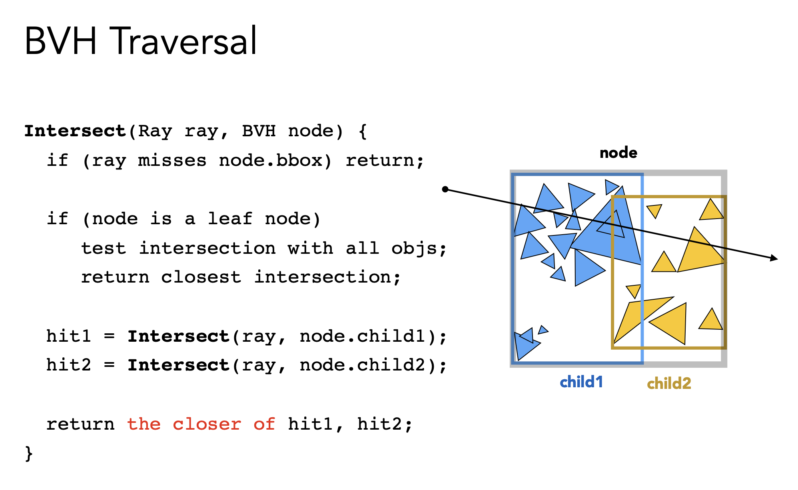

# 什么是 Light Rays？
**Light rays（光线）** 在计算机图形学和物理学中，是指光能在空间中传播的理想化模型，通常被抽象为一条从光源发出、沿直线传播（在均匀介质中）的几何射线。在图形学中，光线模型基于几何光学的基本假设：光线具有位置和方向（通常用参数方程 $\mathbf{p}(t) = \mathbf{o} + t\mathbf{d}$ 表示，其中 $\mathbf{o}$ 为射线起点，$\mathbf{d}$ 为单位方向向量，$t \ge 0$），并且遵循反射定律（入射角等于反射角）和折射定律（斯涅耳定律）。光线携带着能量（即颜色和强度），当与物体表面相交时，会根据材质的散射特性被吸收、反射、折射或漫反射。

在渲染技术中，“光线”有两种常见使用方式：**前向光线追踪**（从光源发射光线，追踪其在场景中的多次反弹后，计算哪些光线最终会进入相机，但这种方式效率极低，因为只有极少数光线能恰好击中相机）和**逆向光线追踪**（从相机发射光线进入场景，利用光路可逆原理，计算该光线对应的贡献——这是所有 Whitted 风格光线追踪、路径追踪和光子映射的基础）。

# 什么是 Ray Casting？
**Ray Casting（光线投射）** 是光线追踪的一种基础形式，指的是从相机向每个像素发射一条视线，计算这条光线与场景中所有物体的第一个交点（即最近的交点），然后根据该交点处的材质属性和光照模型（通常直接计算漫反射、高光以及局部阴影，但不递归处理反射和折射）直接确定像素颜色。与完整的 Whitted 风格光线追踪不同，Ray Casting 不追踪次级光线（反射、折射或阴影光线），因此它无法生成镜面反射、透明折射或间接光照效果，但计算量远小于递归光线追踪。

# 什么是 Ray Tracing？
**Ray Tracing（光线追踪）** 是一种通过模拟光线与物体相互作用的物理规律来生成高度真实感图像的渲染技术。其核心思想是：从相机（眼睛）位置出发，穿过图像平面上的每个像素，向场景中发射一条**视线（primary ray，或称主光线）**，计算这条光线与场景中所有几何物体的最近交点，然后在该交点处，根据材质属性（如漫反射、镜面反射、折射）继续向光源方向或反射/折射方向发射**辅助光线（secondary rays）**，递归地收集这些光线携带的颜色信息，最终累加得到该像素的颜色值。光线追踪能够天然地处理镜面反射（如光滑金属球反射周围环境）、透明折射（如玻璃球扭曲背景）、阴影（通过向光源发射阴影测试光线）、以及全局光照（通过路径追踪收集间接漫反射光）等复杂光路效果，而这些效果在传统光栅化中难以高效且精确地实现。

一个基础的 Whitted-style 光线追踪器（由 Turner Whitted 于 1980 年提出）递归地发射三类光线：**反射光线**（根据入射光线和表面法线计算镜面反射方向）、**折射光线**（根据斯涅尔定律计算穿透透明物体后的方向）以及**阴影光线**（从交点指向光源，检测沿途是否有其他物体阻挡，以确定该点是否被直接光照照亮）。每当光线击中某物体时，该点的直接光照（通常使用 Lambertian 漫反射和 Phong/Blinn-Phong 高光）由阴影光线测试贡献，反射和折射光的贡献则继续递归求解，直到达到最大递归深度或光线能量衰减到阈值以下。递归过程中，每个交点都会产生一个新的光线分支，形成了一个光线树（或光线图），其叶子节点为光源或背景环境。

光线追踪与光栅化在计算方式上有本质区别：光栅化是通过“将物体投影到屏幕上”的方式来推断每个像素的颜色（反向过程），而光线追踪是通过“模拟光路从眼睛进入场景”来精确收集每个像素的贡献（正向过程，尽管方向是从眼睛到光源的逆向追踪）。这种差异使得光线追踪在数学上更符合光线在物理世界中传播的路径，从而能够轻易生成反射、折射、精确阴影（包括软阴影，当使用面光源和多采样时）以及焦散等复杂效果，而无需像光栅化那样采用大量的 Hack 手段（如 Shadow Map、反射探针、环境贴图等近似技术）。

光线追踪的主要缺点是计算量巨大：对于每个像素需要发射多条光线，每条光线需要与场景中所有三角形进行求交测试（尽管可以通过加速结构如 BVH、KD-Tree、Grid 来大幅减少求交次数），且递归分支会导致计算量指数增长。因此，传统的 Whitted 风格光线追踪长期只用于离线渲染（电影特效、建筑可视化、产品设计），难以满足实时交互的需求。自 2018 年以来，NVIDIA 的 RTX 系列 GPU 引入了专用的硬件加速单元（RT Core），实现了 BVH 遍历和光线-三角形求交的硬件级加速，使得实时光线追踪（特别是混合渲染：光栅化为主，光线追踪辅助生成反射、阴影和环境光遮蔽）成为可能。现代游戏（如《赛博朋克2077》、《控制》、《我的世界》RTX 版）利用实时光线追踪大幅提升了反射、阴影和全局光照的质量，但仍需结合降噪算法（denoising）才能在较低的每像素光线采样数下（例如 1~2 条采样，然后通过时空滤波恢复图像）达到可接受的帧率。

从发展趋势来看，光线追踪正在逐步成为实时渲染的标准组件，与光栅化形成互补而非替代关系：光栅化负责高效的基础几何和材质绘制，光线追踪负责光路复杂的特效。而在离线渲染领域，基于物理的**路径追踪**（Path Tracing，光线追踪的一种泛化，每条路径在每次交点处随机选择一种散射方向，而非同时分裂成多个分支）已成为主流算法，它通过大量随机采样来收敛到渲染方程的正确解，能够全局地处理所有类型的材质（包括粗糙表面的漫反射互反射和 glossy 反射），是 Pixar、Disney、Weta Digital 等顶级工作室的默认渲染方案。

### Recursive (Whitted-Style) Ray Tracing 怎么做？
**Recursive (Whitted-Style) Ray Tracing** 是由 Turner Whitted 于 1980 年提出的经典光线追踪算法，它在基础光线投射的基础上引入**递归**，通过模拟光线在镜面反射和透明折射中的传播路径，生成了反射、折射和阴影等复杂光照效果。其核心流程如下：对于每个像素，从相机发射一条主光线（primary ray），计算它与场景中所有几何体的最近交点，得到交点 $P$。在交点 $P$ 处，根据表面材质执行三类操作：
**1) 计算直接光照**：从 $P$ 向场景中的每个点光源发射一条阴影光线（shadow ray），若阴影光线未被其他物体遮挡，则累加该光源对 $P$ 的漫反射和高光贡献（通常使用 Blinn-Phong 或 PBR 材质模型）。
**2) 递归计算镜面反射**：如果表面具有镜面反射属性（例如金属、光滑塑料），根据反射定律 $\mathbf{r} = \mathbf{d} - 2(\mathbf{d} \cdot \mathbf{n})\mathbf{n}$（其中 $\mathbf{d}$ 为入射光线方向，$\mathbf{n}$ 为表面法线）生成反射光线，并递归调用 Ray Tracing 函数，将反射光线带回的颜色值乘以材质的反射系数添加到当前像素颜色。
**3) 递归计算透射（折射）**：如果表面是半透明或透明的（例如玻璃、水），根据斯涅耳定律（Snell's Law）计算折射方向，同时还需考虑菲涅耳效应（Fresnel Effect，即入射角影响反射与折射的比例），生成折射光线并递归追踪，将其返回的颜色乘以透射系数并累加。递归的终止条件包括：达到最大递归深度（通常设为 5-10 层）、光线能量衰减到阈值以下（例如反射系数或透射系数 < 0.01）、或光线击中背景（未与任何物体相交）。

在实现时，每次递归调用都会根据光线与场景的交点继续产生新的光线分支，最终构建出一棵“光线树”，树的叶子节点对应光源或背景颜色，所有节点的贡献按材质比例加权求和后回传到根节点，得到该像素的最终颜色。Whitted 风格光线追踪的优点是能够精确生成镜面反射和透明折射效果，且实现逻辑清晰，但由于不支持漫反射表面间的间接光照（即全局光照中的漫反射互反射，如 color bleeding），因此在处理粗糙材质时真实感不足。此外，由于每条光线都需要与场景中所有物体求交（尽管可以使用加速结构如 BVH、KD-Tree 或 Uniform Grid），计算量随递归深度和光线数量呈指数增长，长期仅限于离线渲染。现代混合渲染管线中，Whitted 风格常用于生成高质量反射和透明效果（例如游戏中的镜面、窗户），而漫反射全局光照则由路径追踪或基于辐照度的方案替代。

# Ray-Surface Intersection 是什么？
**Ray-Surface Intersection** 是光线追踪的核心计算步骤，即求解光线与几何表面（如球体、三角形、平面、隐式曲面）的最近交点，并获取交点的位置、法线和材质属性。其基础是光线的参数方程：$\mathbf{R}(t) = \mathbf{O} + t\mathbf{D}$，其中 $\mathbf{O}$ 是射线起点，$\mathbf{D}$ 是归一化的方向向量，$t \ge 0$ 为沿射线的距离参数。对于不同的曲面类型，求解交点即寻找最小的正根 $t$ 满足 $\mathbf{R}(t)$ 在曲面上。

### Ray Intersection With Sphere
假设球心为 $\mathbf{C}$，半径为 $R$，则交点满足 $\| \mathbf{O} + t\mathbf{D} - \mathbf{C} \|^2 = R^2$。展开并整理关于 $t$ 的二次方程 $(\mathbf{D} \cdot \mathbf{D}) t^2 + 2(\mathbf{O} - \mathbf{C}) \cdot \mathbf{D} \cdot t + (\mathbf{O} - \mathbf{C}) \cdot (\mathbf{O} - \mathbf{C}) - R^2 = 0$。由于 $\mathbf{D}$ 是单位向量，$\mathbf{D} \cdot \mathbf{D} = 1$，因此方程简化为 $t^2 + 2\mathbf{b} t + c = 0$，其中 $\mathbf{b} = (\mathbf{O} - \mathbf{C}) \cdot \mathbf{D}$，$c = (\mathbf{O} - \mathbf{C}) \cdot (\mathbf{O} - \mathbf{C}) - R^2$。判别式 $\Delta = 4(\mathbf{b}^2 - c)$：若 $\Delta < 0$ 则无交点；若 $\Delta = 0$ 则射线与球相切（一个解 $t = -\mathbf{b}$）；若 $\Delta > 0$ 则有两个交点 $t = -\mathbf{b} \pm \sqrt{\mathbf{b}^2 - c}$，取最小的非负 $t$ 作为最近交点。

### Ray Intersection With Implicit Surface
对于由隐式方程 $F(x, y, z) = 0$ 定义的曲面（如 $x^2 + y^2 + z^2 - 1 = 0$ 表示单位球），将射线的参数形式 $(x, y, z) = (O_x + t D_x, O_y + t D_y, O_z + t D_z)$ 代入 $F$，得到一个关于 $t$ 的方程 $F(\mathbf{O} + t\mathbf{D}) = 0$。该方程可能是任意阶（对于代数曲面）或超越方程（对于包含三角函数、指数函数的隐式曲面）。对于代数多项式曲面，通常通过数值方法（如牛顿迭代）或解析公式（对于次数 ≤ 4 的多项式有求根公式）求解最小正根；对于一般隐式曲面，往往需要结合区间分析和步进法（如 Sphere Tracing）来找到交点。求解后还需验证交点处的梯度 $\nabla F$ 是否非零，以确定法线方向 $\mathbf{n} = \nabla F / \|\nabla F\|$。隐式曲面求交在基于 SDF（有符号距离函数）的渲染中非常重要，常见于 Shadertoy 等纯几何建模场景。

### Ray Intersection With Plane
给定平面方程为 $\mathbf{n} \cdot \mathbf{X} + d = 0$，其中 $\mathbf{n}$ 是单位法向量，$d$ 是平面到原点的有向距离。将射线 $\mathbf{R}(t) = \mathbf{O} + t\mathbf{D}$ 代入得 $\mathbf{n} \cdot (\mathbf{O} + t\mathbf{D}) + d = 0$，解出 $t = -\frac{\mathbf{n} \cdot \mathbf{O} + d}{\mathbf{n} \cdot \mathbf{D}}$。若分母 $\mathbf{n} \cdot \mathbf{D} = 0$，则射线与平面平行（无交点或无限多交点）。否则，若 $t \ge 0$ 则存在唯一交点 $\mathbf{P} = \mathbf{O} + t\mathbf{D}$。对于有界平面（如矩形、多边形），还需进一步判断 $\mathbf{P}$ 是否在边界内（例如将 $\mathbf{P}$ 转换到局部二维坐标系，测试是否在多边形内部）。平面求交通常用于处理无限大地平面、水面、镜面以及 Decal（贴花）投影等场景。

### Ray Intersection With Triangle
给定三角形三个顶点 $\mathbf{V}_0, \mathbf{V}_1, \mathbf{V}_2$，常用**Möller–Trumbore 算法**（1997）。该算法首先将交点表示为重心坐标形式：$\mathbf{O} + t\mathbf{D} = (1 - u - v) \mathbf{V}_0 + u \mathbf{V}_1 + v \mathbf{V}_2$，其中 $u \ge 0, v \ge 0, u+v \le 1$ 且 $t > 0$。设 $\mathbf{E}_1 = \mathbf{V}_1 - \mathbf{V}_0$，$\mathbf{E}_2 = \mathbf{V}_2 - \mathbf{V}_0$，$\mathbf{T} = \mathbf{O} - \mathbf{V}_0$，则方程可改写为矩阵形式 $[- \mathbf{D}, \mathbf{E}_1, \mathbf{E}_2] \cdot [t, u, v]^T = \mathbf{T}$。使用克莱姆法则求解：令 $\mathbf{P} = \mathbf{D} \times \mathbf{E}_2$，计算 $det = \mathbf{P} \cdot \mathbf{E}_1$。若 $|det| < \epsilon$（平行或三角形退化），则无交点；否则计算 $\mathbf{T}$ 与 $\mathbf{E}_1, \mathbf{E}_2$ 的叉积并逐次得到 $u, v, t$。其中 $u = (\mathbf{T} \times \mathbf{E}_1) \cdot \mathbf{P} / det$，$v = (\mathbf{D} \times \mathbf{E}_2) \cdot \mathbf{T} / det$，$t = (\mathbf{E}_2 \times \mathbf{T}) \cdot \mathbf{P} / det$。最后验证 $t \ge 0$，$u \ge 0$，$v \ge 0$，且 $u+v \le 1$。该算法避免了显式计算平面方程，且只需存储顶点坐标，是光线追踪中最常用的三角形求交方法。

# 如何加速 Ray Tracing？
加速光线追踪的核心思想是**避免对场景中所有图元进行无差别求交**，通过构建空间索引结构快速跳过空白区域和明显不被命中的物体。两种最基础的加速技术是**包围盒**（Bounding Volumes）和**光线与轴对齐包围盒求交**，它们构成了更高级的 BVH 和 KD-Tree 等加速结构的基础。

**Bounding Volumes（包围盒）**：用一个简单的几何体（如球体、轴对齐包围盒 AABB、定向包围盒 OBB）紧密包裹复杂物体或一组物体。光线追踪时，先测试光线是否与包围盒相交：如果不相交，则直接跳过整个物体组，无需对内部的三角形进行逐一遍历；如果相交，再进入内部进行细化求交。由于包围盒的求交计算量远低于与内部所有三角形的求交总和（尤其当组内面数较多时），这能大幅减少计算量。包围盒应具备计算简单、紧密性好、存储小的特点，AABB 因其仅需存储最小/最大角点、求交高效，成为最常用的选择。

**Ray Intersection with Axis-Aligned Box（光线与 AABB 求交）**：给定轴对齐包围盒由最小点 $\mathbf{p}_{\min} = (x_{\min}, y_{\min}, z_{\min})$ 和最大点 $\mathbf{p}_{\max} = (x_{\max}, y_{\max}, z_{\max})$ 定义。光线 $\mathbf{R}(t) = \mathbf{O} + t\mathbf{D}$ 与 AABB 的求交可采用 **slab 法**：分别计算光线与三组平行平面（$x=x_{\min}$ 和 $x=x_{\max}$、$y=y_{\min}$ 和 $y=y_{\max}$、$z=z_{\min}$ 和 $z=z_{\max}$）的交点参数 $t$，然后取各组的 $t_{\min}$ 和 $t_{\max}$，最终的交集区间为 $t_{\text{enter}} = \max(t_{\min}^{(x)}, t_{\min}^{(y)}, t_{\min}^{(z)})$，$t_{\text{exit}} = \min(t_{\max}^{(x)}, t_{\max}^{(y)}, t_{\max}^{(z)})$。若 $t_{\text{enter}} \le t_{\text{exit}}$ 且 $t_{\text{exit}} \ge 0$，则光线与 AABB 相交，且有效的交点范围是 $[t_{\text{enter}}, t_{\text{exit}}]$（对于光线追踪通常取 $t_{\text{enter}}$ 作为进入包围盒的最近交点）。计算时，对每个轴 $i \in \{x, y, z\}$：
- 若 $|D_i| < \epsilon$（光线与平面几乎平行）：检查射线的原点 $O_i$ 是否在 $[p_{\min,i}, p_{\max,i}]$ 范围内，否则无交点。
- 否则，计算 $t_{i,\min} = \frac{p_{\min,i} - O_i}{D_i}$，$t_{i,\max} = \frac{p_{\max,i} - O_i}{D_i}$，并交换使 $t_{i,\min} \le t_{i,\max}$。
然后 $t_{\text{enter}} = \max(t_{x,\min}, t_{y,\min}, t_{z,\min})$，$t_{\text{exit}} = \min(t_{x,\max}, t_{y,\max}, t_{z,\max})$。AABB 求交的优点是计算仅需若干除法、比较和取最大/最小操作，且无分支（现代 CPU/GPU 可高效预测），是 BVH 节点遍历的核心步骤。

**组合使用**：将物体递归地划分到 BVH（Bounding Volume Hierarchy）树中，每个内部节点存储其子节点们的外包 AABB，叶子节点存储实际三角形。光线追踪时，从根节点开始，若光线与当前节点的 AABB 相交，则递归进入子节点；否则裁剪整个子树。这种方式将求交复杂度从 $O(N)$ 降低到平均 $O(\log N)$（对于分布良好的场景）。类似的加速结构还有 KD-Tree（将空间递归划分为两半，光线与内部平面快速求交）和 Uniform Grid（将空间划分成网格，光线步进穿过网格单元）。在现代 GPU 光线追踪硬件（如 NVIDIA RT Core）中，BVH 的遍历和 AABB 求交由专用电路加速，进一步提升了效率。

### Spatial Partitions 是什么？
**Spatial Partitions**（空间划分）是一类通过将三维空间递归或非递归地划分为不相交的区域（叶子节点），并为每个区域存储其中包含的几何物体列表，从而加速光线追踪中光线-物体求交查询的数据结构。其核心思想是：利用光线的局部性，只对光线穿过的少数区域内的物体进行精确求交测试，而跳过光线根本不会到达的空白或远距离区域，将平均求交复杂度从 $O(N)$（$N$ 为场景物体总数）降低到 $O(\log N)$ 或 $O(N^{2/3})$ 量级。根据划分方式的不同，空间划分主要分为**均匀划分**（Uniform Grids，将包围盒切分为规则网格）、**树状自适应划分**（如 KD-Tree、BVH、Octree、BSP 树），以及介于两者之间的混合方法。所有空间划分都需要平衡两个相互制约的因素：**划分的开销**（构建数据结构的时间）和**查询的效率**（光线遍历过程中需要测试的节点数量）。理想的划分应使每个区域内包含的物体数量极少，同时尽量保证区域在空间中紧凑（避免光线频繁穿越空区域）。

**主要类型**：
- **均匀网格**：将场景包围盒划分为固定大小的三维网格，每个网格单元存储与之相交的物体列表。光线遍历采用 3D-DDA 算法逐网格步进。构建速度快，适合均匀分布的场景（如粒子），但在物体分布极度不均时效率低下。
- **KD-Tree**：一种二叉树，每次沿着与坐标轴垂直的平面（如 $x=c$、$y=c$ 或 $z=c$）将空间划分为两个子空间，递归进行直到叶子节点包含的物体数少于阈值或达到最大深度。划分平面的位置通常通过启发式（如表面积启发式 SAH，Surface Area Heuristic）来选择，以平衡左右子树的面积和物体数量。KD-Tree 的遍历算法类似网格步进，但需要根据光线方向动态决定进入左右子树的顺序（先近后远）。优点是对非均匀分布场景适应性强，查询效率高（尤其适合静态场景）；缺点是构建较慢，且物体若跨平面则需同时存储于两侧（或通过剪裁处理），且动态更新困难。
- **BVH**（Bounding Volume Hierarchy）：物体层次结构，每个节点存储一个紧包裹其子节点所有物体的包围盒（通常为 AABB），叶子节点存储物体列表。与 KD-Tree 划分空间不同，BVH 是划分物体集合，因此每个物体只出现在一个叶子节点中。BVH 的构建可以采用自顶向下（按中位数或 SAH 分割物体集）或自底向上（合并邻近物体）。BVH 的遍历算法是递归的：若光线与当前节点包围盒相交，则继续进入子节点；否则剪枝。BVH 对动态场景的支持较好（可通过 refit 更新包围盒），且支持光线与包围盒的快速求交（AABB slab 法），因此成为现代 GPU 光线追踪硬件（如 NVIDIA RT Core）的原生加速结构。
- **Octree**（八叉树）：将空间递归划分为八个卦限（八等分），每个节点存储在该立方体内的物体列表。构建简单，适合表示稀疏场景（地形、体素数据），但划分固定（每层将尺寸减半），不如 KD-Tree 灵活，且对薄片物体的紧密度较差。
- **BSP 树**：Binary Space Partitioning，与 KD-Tree 类似，但划分平面可以不与坐标轴垂直（即任意方向的平面），多用于游戏引擎中的静态关卡分割和 CSG 操作。在现代实时光线追踪中较少使用，因存储开销大且遍历复杂。

**关键概念 - SAH（表面积启发式）**：在构建 KD-Tree 或 BVH 时，用于选择划分位置的成本模型。SAH 估计光线与节点相交的概率正比于节点的表面积（假设光线方向均匀随机），因此划分成本 $C = C_{\text{traverse}} + \frac{SA_{\text{left}}}{SA_{\text{node}}} \cdot N_{\text{left}} \cdot C_{\text{intersect}} + \frac{SA_{\text{right}}}{SA_{\text{node}}} \cdot N_{\text{right}} \cdot C_{\text{intersect}}$，通过最小化该成本来选择最优划分平面。使用 SAH 构建的加速结构在实际渲染中能提升 2-10 倍效率。

**选择指南**：
- **静态复杂场景**：KD-Tree 或 BVH + SAH 构建（离线预处理），查询效率最佳。
- **动态物体**：BVH（每帧 refit）或 Uniform Grid（每帧重建）。
- **极度均匀分布**（如粒子云）：Uniform Grid 最简且高效。
- **体数据和体积渲染**：Octree 或 Sparse Voxel Octree (SVO)。
- **硬件加速光线追踪**：BVH（现代 GPU 内置加速遍历和求交单元）。

### Bounding Volume Hierarchy (BVH) 是什么？
**Bounding Volume Hierarchy (BVH)** 是一种基于物体空间划分的树形加速结构，用于光线追踪中快速剔除与光线不相交的物体组。其核心思想是将场景中的几何物体（通常为三角形）递归地划分成子集，并为每个子集计算一个紧贴的包围盒（Bounding Volume，通常为轴对齐包围盒 AABB），从而构成一棵树：树的根节点包裹整个场景，内部节点包裹其所有子节点的物体，叶子节点存储实际的三角形列表。光线与场景求交时，从根节点开始测试：若光线与当前节点的包围盒不相交，则直接跳过整个子树；若相交，则递归进入子节点，直到叶子节点，再对该叶子内的所有三角形进行精确求交，最终记录所有命中中 $t$ 值最小的交点。

**BVH 的构建**（自顶向下方式）：
1. 计算所有物体的外包盒作为根节点。
2. 若当前节点内物体数量少于阈值（如 4 个），则停止划分，将该节点标记为叶子节点。
3. 否则，选择一个划分轴（通常为包围盒最长的轴向）和一个划分点（位置），将物体集划分为两个子集。
4. 分别计算两个子集的包围盒，并递归构建左右子树。

划分点的选择对 BVH 的查询效率至关重要。最常用的策略是 **SAH（Surface Area Heuristic，表面积启发式）**：对于候选划分位置，计算成本函数 $C = C_{\text{traverse}} + \frac{SA_{\text{left}}}{SA_{\text{node}}} \cdot N_{\text{left}} \cdot C_{\text{intersect}} + \frac{SA_{\text{right}}}{SA_{\text{node}}} \cdot N_{\text{right}} \cdot C_{\text{intersect}}$，其中 $SA$ 为包围盒表面积，$N$ 为子集内的物体数，$C_{\text{traverse}}$ 和 $C_{\text{intersect}}$ 为启发式常数（通常分别设为 1 和 2-10）。选择使 $C$ 最小化的划分位置（通常采样若干候选边界进行求值）。SAH 构建的 BVH 能显著提升光线遍历效率（2-10 倍），尤其适合物体分布不均匀的场景。

**BVH 的遍历**（递归算法）：
给定光线 $\mathbf{R}(t) = \mathbf{O} + t\mathbf{D}$，从根节点开始：
- 计算光线与当前节点 AABB 的交点区间 $[t_{\text{enter}}, t_{\text{exit}}]$（使用 slab 法，如光线与 AABB 求交所述）。若 $t_{\text{enter}} > t_{\text{exit}}$ 或 $t_{\text{exit}} < 0$，则返回无交点。
- 对于内部节点，若光线与左右子树的包围盒均相交，则根据 $t_{\text{enter}}$ 的顺序优先进入较近的子树（以加速发现最近交点），递归遍历另一子树时利用已找到的交点 $t_{\text{hit}}$ 进行剪枝（若 $t_{\text{enter, other}} > t_{\text{hit}}$，则可跳过）。
- 对于叶子节点，遍历其中的所有三角形，使用 Möller-Trumbore 算法求交，记录最近的交点 $t_{\text{hit}}$。

**BVH 的优点**：
- **良好的空间适应性**：物体集划分使每个物体只存在于一个叶子中（无重复存储），存储开销可控。
- **支持动态更新**：对于轻微变形的物体（如蒙皮动画），只需更新叶子节点的包围盒并向上重新计算父节点包围盒（称为 refit），无需重建整棵树。
- **易于硬件加速**：现代 GPU（如 NVIDIA RT Core）内置了 BVH 压缩格式、栈管理和 AABB 求交单元，使得实时光线追踪中的 BVH 遍历达到数十亿光线/秒的吞吐量。
- **与任何包围盒形状兼容**：虽然 AABB 最常用，但也可以使用球体、OBB 或 k-DOP，以更好地适应细长物体。

**BVH 的缺点**：
- **包围盒可能重叠**：不同子树的包围盒可能相交，导致光线需要同时遍历多个分支（不像 KD-Tree 那样严格划分空间）。但重叠程度较低时，对性能影响有限。
- **构建时间相对较长**：尤其在使用 SAH 时，需要对物体排序和多次计算表面积，对于静态场景可离线预处理，对于动态场景则需权衡重建频率。

# Radiometry 是什么？
**Radiometry（辐射度量学）** 是研究电磁辐射（尤其是可见光）能量在空间传播与度量的一门学科，在计算机图形学中，它为光照和材质的物理建模提供了严格的理论基础。传统图形学中的 Phong 或 Blinn-Phong 光照模型是经验性的（即为了视觉效果而“捏造”的公式），而基于辐射度量学构建的渲染方法（如路径追踪、光子映射）能够生成物理准确的图像，因为这些方法直接求解真实光能传递过程的数学描述——**渲染方程**。辐射度量学定义了四个相互关联的核心物理量，它们从不同角度描述了光能的分布与变换：

1.  **Radiant Energy (Q)**：辐射能，单位为焦耳 (J)，表示光源发射或表面接收的总光能量，通常用于描述瞬时能量（如闪光灯一次闪烁释放的总能量）。在稳态渲染中，更常用的是能量随时间的变化率，即辐射通量。

2.  **Radiant Flux (Φ)**：辐射通量（也称功率），单位瓦特 (W = J/s)，表示单位时间内通过某一区域或从光源发射的总能量。例如，一个 60W 的白炽灯泡每秒发射 60 焦耳的光能。在实际渲染中，我们关心的是不同波长的功率分布，称为**光谱辐射通量**。

3.  **Radiant Intensity (I)**：辐射强度，单位为瓦特每球面度 (W/sr)，表示从点光源出发，在单位立体角内发射的辐射通量，即 $I = \frac{d\Phi}{d\omega}$。该量仅用于描述点光源或极小光源的方向性分布，例如一个 LED 灯珠在某个方向上的发光强度。

4.  **Irradiance (E)**：辐照度，单位为瓦特每平方米 (W/m²)，表示单位面积上接收（到达）的辐射通量，即 $E = \frac{d\Phi}{dA}$。它描述的是“有多少光落到了表面上”，是漫反射光照计算的关键输入。注意，$dA$ 是实际表面积，而非投影面积，所以当光线倾斜照射时，相同通量会分布在更大的面积上，导致辐照度降低（这正好解释了 Lambert 余弦定律的物理成因）。

5.  **Radiance (L)**：辐射亮度，单位为瓦特每球面度每平方米 (W/(sr·m²))，是辐射度量学中最核心也是最重要的量，定义为沿特定方向 $(\theta, \phi)$ 的单位投影面积在单位立体角内发出（或接收）的辐射通量：$L = \frac{d^2\Phi}{dA \cos\theta \, d\omega}$。其中 $dA \cos\theta$ 是面积 $dA$ 在垂直于光线方向的投影面积。Radiance 有一个关键性质：在真空中沿直线传播时保持不变（不考虑散射和吸收），这使得它非常适合用于光线追踪——我们可以沿着光线从一点携带 radiance 值到另一点，而不用担心距离造成的衰减（衰减只发生在与介质的交互或表面的吸收/散射中）。此外，所有传感器（包括人眼和相机 CCD）对场景的感知本质上是对入射到其探测面上的 radiance 的响应，因此 Radiance 是最终决定像素颜色的物理量。

**从辐射度量到渲染方程**：基于这些定义，表面出射的 radiance $L_o(\mathbf{p}, \omega_o)$ 等于自发光 $L_e(\mathbf{p}, \omega_o)$ 加上来自所有方向的入射 radiance $L_i(\mathbf{p}, \omega_i)$ 经过表面 BSDF（双向散射分布函数）$f(\mathbf{p}, \omega_i \to \omega_o)$ 散射后的积分：
$$ L_o(\mathbf{p}, \omega_o) = L_e(\mathbf{p}, \omega_o) + \int_{\mathcal{H}^2} f(\mathbf{p}, \omega_i \to \omega_o) \, L_i(\mathbf{p}, \omega_i) \, \cos\theta_i \, d\omega_i $$
其中 $\cos\theta_i = \mathbf{n} \cdot \omega_i$，积分域 $\mathcal{H}^2$ 为以法线 $\mathbf{n}$ 为中心的半球面。该方程是现代计算机图形学中所有物理真实感渲染算法的起点。

**与光度学的区别**：辐射度量学是纯物理的、与波长相关的能量度量，不考虑人眼对不同波长光的敏感度差异；而**光度学**（Photometry）则在辐射度量学的基础上，使用人眼视觉效率函数（明视觉 V(λ) 曲线）对每个波长加权，得到感知亮度（单位流明、勒克斯等）。在图形学中，我们通常直接使用 RGB 三通道近似辐射度量，而忽略完整的光谱分布，故常混用“辐射度”与“亮度”等术语，但理论根基仍是辐射度量学。