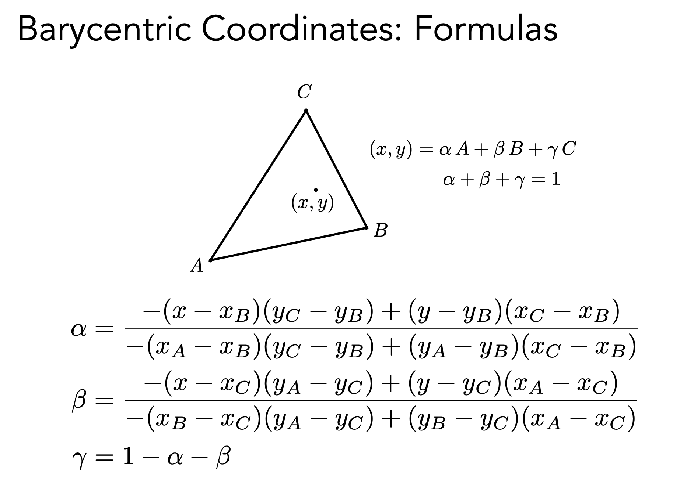
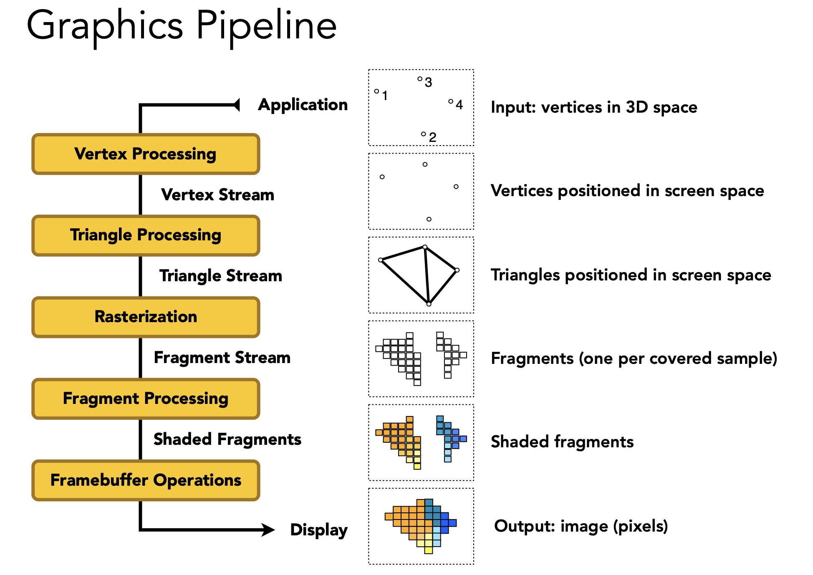

# 目录

- Z-buffer
  - Z-buffer 作用
  - 为什么 Z-buffer 能做到看似“线性”？
- Shading
  - 什么是 Shading？
- Blinn-Phong Reflection Model
  - Blinn-Phong Reflection Model 是什么？
  - 为什么说 “Shading is Local”？
  - Lambert's cosine law 是什么？
  - Lambertian (Diffuse) Shading 怎么形成？
  - Specular Term 怎么形成？
  - Ambient Term 怎么形成？
- Shading Techniques
  - Flat shading, Gouraud shading 和 Phong shading 分别是什么？
  - 如何获得顶点的法线？
  - 顶点法线如何插值获得中间的法线？
- Interpolation
  - Interpolation（插值）是什么？
  - 如何获得重心坐标？
- Graphics Pipeline
  - Graphics Pipeline 是什么？
  - Shader Programs 基础
  - 渲染管线和GPU的关系是什么？
- Texture Mapping
  - Texture Mapping 是什么？
  - 漫反射纹理映射
  - 如何处理 Texture Magnification（纹理放大）？
  - 区分 Point Query vs. (Avg.) Range Query
  - Mipmap 是什么？
  - 如何计算纹理坐标处的 LOD（细节层级）参数？
  - Anisotropic Filtering 是什么？
  - EWA filtering 是什么？
  - Environment Map 和 Environment Lightning分别是什么？
  - Bump Mapping 是什么？
  - Displacement Mapping 是什么？
  - Procedural Texture 是什么？
- Volume Rendering
  - Volume Rendering是什么？

# Z-buffer 作用
Z-buffer，也称为深度缓冲（Depth Buffer），是图形渲染管线中一块与屏幕分辨率大小相同的显存区域，用于记录每个像素当前距离相机的**深度值**（通常是归一化后的0到1范围，近平面为0，远平面为1）。它的核心作用是解决**可见性/遮挡问题**，即当多个三角形投射到屏幕的同一个像素上时，GPU能够判断哪一个三角形离相机最近，从而只显示那个三角形的颜色，而丢弃被遮挡的部分。具体工作原理是：在光栅化每个三角形时，GPU会计算出该三角形在每个像素位置上的深度值，并将其与Z-buffer中已存储的深度值进行比较——如果新深度值更小（即更靠近相机），则用新颜色覆盖帧缓冲，并用新深度值更新Z-buffer；如果新深度值更大（即被已有物体遮挡），则直接丢弃该片元。这一机制无需对场景中的三角形进行排序，能够高效正确地渲染任意复杂顺序的几何体，是现代GPU实现实时渲染的关键技术之一。

### 为什么 Z-buffer 能做到看似“线性”？
Z-buffer之所以能在线性时间内处理n个三角形，本质原因在于它完全绕开了全局排序这个复杂度下限为O(nlogn)的经典难题，转而采用一种逐像素的、O(1)的比较操作来判定遮挡关系。具体来说，Z-buffer维护一个与屏幕分辨率大小相同的深度缓存，当任意顺序的三角形被光栅化时，GPU只需分别计算每个像素处的新深度值，并与缓存中已有的深度做一次简单比较：新值更近则更新颜色和深度，否则丢弃该片元。这个比较操作的时间与三角形总数n无关，而仅取决于每个三角形覆盖的像素数量（即屏幕面积），将所有三角形的像素覆盖量累加起来恰好就是总处理量——每个像素在每一帧里会被访问常数次。因此，尽管处理单个三角形的代价与其大小成正比，但整个场景的代价是各三角形代价之和，即O(n + 屏幕分辨率)，在图形学实践中这被视为线性时间。换言之，Z-buffer用空间换取了时间，通过增加每像素的存储（深度缓存）避免了对三角形进行昂贵的全局预排序，从而实现了近线性的渲染性能。

# 什么是 Shading？
Shading（着色）是指根据光照、材质属性以及物体表面几何信息，计算并确定三维物体表面在屏幕上所呈现的最终颜色和明暗变化的过程。简单来说，它回答了“这个像素应该是什么颜色”的问题。这个过程通常包括计算光源与表面法线的夹角以确定漫反射强度，根据视角与反射方向计算高光，以及叠加环境光等成分。常见的光照模型如Blinn-Phong模型，而现代渲染中更复杂的PBR（基于物理的着色）也是shading的一种具体实现。

需要特别注意的是，shading常常与“着色器（Shader）”混淆：着色器是执行shading计算的那段运行在GPU上的程序代码，而shading本身指的是这个颜色计算的过程或概念。

# Blinn-Phong Reflection Model 是什么？
Blinn-Phong反射模型是一种经典的、用于实时渲染的经验式光照模型，它通过将光照分解为**环境光（Ambient lightning）、漫反射（Diffuse reflection）和高光（Specular highlights）** 三个独立分量，来高效地模拟物体表面的明暗与光泽感。其中，环境光分量用一个常量模拟场景中无方向性的间接光照，防止背光面变成全黑；漫反射分量基于朗伯余弦定律，根据表面法线与光线方向的点积来计算，体现光线在粗糙表面均匀反射的效果，与观察角度无关；而高光分量则是Blinn-Phong对原始Phong模型的改进，它引入**半角向量**（即光线方向与视线方向的角平分线），替代了Phong模型中计算反射向量与视线夹角的方式，用半角向量与表面法线的点积来衡量高光的强度。这一改进能更高效地模拟光滑金属或塑料表面的镜面高光，且计算成本更低、避免了一些数学上的奇点情况。

尽管Blinn-Phong模型因不严格遵循能量守恒、无法准确表现复杂材质而逐渐被基于物理的PBR模型取代，但由于其实现简单、计算快速且视觉直观，至今仍在移动端游戏、旧版引擎以及教学演示中被广泛使用。

### 为什么说 “Shading is Local”？
“Shading is local”指的是在传统着色模型（如Blinn-Phong）中，**表面上任意一点的颜色计算仅依赖于该点自身的局部属性，而不考虑场景中其他物体对该点的光线遮挡或交互影响**。具体来说，计算一个像素的最终颜色时，只需要知道该点的**法线方向**、**材质颜色**、**光源方向**和**观察方向**，以及光源本身的参数（颜色、强度），完全不需要知道场景中是否有其他物体挡在光线路径上，也不需要计算其他物体反射来的间接光线。

这种局部性带来的最大优点是**计算极其快速**，因为它避开了全局光照明中复杂的光线追踪或辐射度计算，使得实时渲染成为可能。但缺点也很明显：它**无法产生阴影**（除非用Shadow Map额外处理），无法表现物体之间的颜色溢出（比如红墙把红色反光染到白球上），也无法模拟焦散或间接光照等全局效果。因此，“shading is local”既是对传统实时渲染方法高效性的概括，也同时指出了它与物理真实感之间最本质的差距——为了性能而牺牲了光线在场景中全局传播的模拟。

### Lambert's cosine law 是什么？
Lambert's cosine law 是描述理想漫反射表面（朗伯表面）亮度特性的光学定律，其核心内容为：**从任意方向观察一个朗伯表面时，它所反射的光强与表面法线和入射光线方向夹角的余弦值成正比**。数学上表示为  $I = I_{in} \cdot k_d \cdot \max(0, \hat{n} \cdot \hat{l})$，其中 $(\hat{n})$ 是表面单位法线，$(\hat{l})$ 是从表面指向光源的单位向量，两者的点积即为余弦值。这意味着当光线垂直照射表面（夹角0°）时反射最强，随着光线逐渐倾斜（夹角增大），反射强度按余弦曲线衰减，当光线平行于表面（夹角90°）或从背面照射（夹角>90°）时反射强度为零。这一规律的本质是由于光线倾斜时，相同束宽的光束覆盖了更大的表面积，导致单位面积接收的辐射通量按余弦比例下降。在图形学中，该定律是实现漫反射光照计算的基础，用于模拟纸张、粉墙、磨砂表面等粗糙材质的均匀反射特性。

### Lambertian (Diffuse) Shading 怎么形成？
Lambertian Shading（或称漫反射着色）是一种基于朗伯余弦定律计算粗糙表面漫反射光照的局部光照模型，其核心特征是**反射强度与观察角度无关，仅取决于表面法线与光线方向的夹角**。其数学表达式为 $I_{\text{diffuse}} = k_d \cdot I_{\text{light}} \cdot \max(0, \hat{n} \cdot \hat{l}) \cdot \text{Attenuation}$，其中 $k_d$ 是物体表面的漫反射系数（即材质颜色/吸收能量程度），$I_{\text{light}}$ 是光源的原始强度，$\hat{n}$ 和 $\hat{l}$ 分别是单位法向量与指向光源的单位向量，$\max(0, \hat{n} \cdot \hat{l})$ 保证了光线从背面照射时不贡献光强。注意，虽然物理上点光源的辐照度遵循平方反比定律（即距离衰减项 $\text{Attenuation} = 1/r^2$），但在经典的基础 Lambertian 公式中，$1/r^2$ 项往往被归为光源自身的属性而非 Lambertian 模型的核心部分，因此许多实时渲染的简化版本会直接省略衰减项，或者用引擎提供的距离衰减函数替换。

Lambertian Shading 的实现极其简单高效，适合模拟纸张、墙面、哑光塑料等粗糙无高光的材质，但它完全是局部的——不考虑阴影、不考虑物体间的间接反射，也不考虑材质的高光或粗糙度变化，因此现代基于物理的渲染（PBR）通常会使用更复杂的微平面 BRDF 模型（如 Oren-Nayar 或 Disney Diffuse）来替代经典 Lambertian 模型。

### Specular Term 怎么形成？
在Blinn-Phong模型中，高光项（Specular Term）通过引入**半角向量**来模拟光滑表面上的镜面反射高光，其核心公式为 $I_{\text{specular}} = k_s \cdot I_{\text{light}} \cdot \max(0, \hat{n} \cdot \hat{h})^{\text{shininess}}$，其中 $k_s$ 是镜面反射系数（通常为白色或材质的高光颜色），$I_{\text{light}}$ 是光源强度，$\hat{n}$ 是表面单位法向量，**半角向量** $\hat{h}$ 定义为视线方向 $\hat{v}$ 与光线方向 $\hat{l}$ 的角平分线，即 $\hat{h} = \frac{\hat{l} + \hat{v}}{\|\hat{l} + \hat{v}\|}$，$\text{shininess}$（也称光泽度）是控制高光聚集程度的指数，数值越大高光区域越小越亮，模拟越光滑的表面（如金属或镜面），数值越小高光区域越大越柔和，模拟较粗糙的光滑表面（如塑料或釉质）。Blinn-Phong相比原始Phong模型的改进在于：原始Phong需要计算反射向量 $\hat{r}$ 与视线向量 $\hat{v}$ 的点积，即 $\max(0, \hat{r} \cdot \hat{v})^{\text{shininess}}$，其中 $\hat{r} = 2(\hat{n} \cdot \hat{l})\hat{n} - \hat{l}$；而Blinn-Phong直接用 $\hat{n} \cdot \hat{h}$ 替代，这个计算更为高效，因为 $\hat{h}$ 仅依赖于 $\hat{l}$ 和 $\hat{v}$ 的加法与归一化，避免了反射向量的计算，同时在视觉上能产生更柔和、更自然的高光过渡，并且当视线与光线夹角大于90度时不会像Phong那样完全消失为零。

然而，Blinn-Phong高光模型是不符合物理能量守恒的：它既没有考虑镜面反射会消耗部分入射光能量导致漫反射减弱，也没有处理菲涅尔效应（Fresnel Effect，即视线掠射时反射率增强），因此现代基于物理的渲染（PBR）会采用微平面BRDF模型中的Cook-Torrance高光项，并引入粗糙度参数和菲涅尔项来替代Blinn-Phong的经验式高光。

### Ambient Term 怎么形成？
在Blinn-Phong以及经典的局部光照模型中，环境光项（Ambient Term）是为了弥补“shading is local”导致的严重缺陷——即完全忽略间接光照会使背光面和阴影区域呈现全黑，这与人眼在真实世界中总能感受到环境中的散射光（如墙壁、天花板反射的微弱光线）不符。因此，环境光项采用一种粗暴的**经验式近似**，其公式为 $I_{\text{ambient}} = k_a \cdot I_{\text{global}}$，其中 $k_a$ 是材质的环境光反射系数（通常取值为漫反射系数 $k_d$ 的一个较小倍数或单独控制），$I_{\text{global}}$ 是一个全局常数，代表场景中假设的均匀、无方向性的间接光照强度。这一项**不依赖于光源位置**、**不依赖于表面法线**、**也不依赖于视线方向**，它对场景中的所有表面（无论朝向何处或是否被遮挡）都加上一个恒定的基础亮度，从而避免背光面变成死黑。这种近似在计算上几乎零成本，对于早期实时渲染和简单场景是足够有效的技巧。

然而，Ambient Term完全忽略了环境光照的真实物理行为：在真实世界中，环境光不是均匀的，它会受到遮挡关系（如角落更暗）、间接高光以及颜色溢出（如红墙把红色光线漫反射到相邻白球上）等复杂因素的影响。为了模拟更真实的环境光照，现代渲染引擎（如虚幻引擎5）通常会使用光照探针（Light Probe）、球谐光照（Spherical Harmonics）或基于图像的光照（IBL，Image-Based Lighting）来替代这个简单的常数环境光项。

# Flat shading, Gouraud shading 和 Phong shading 分别是什么？
Flat Shading、Gouraud Shading 和 Phong Shading 是三种不同精度的光照着色技术（频率），它们的主要区别在于光照计算发生的时机和插值方式。

**Flat Shading（平坦着色）** 是最简单的方法：它只计算每个多边形（通常是三角形）的**一条唯一法线**（例如取三顶点法线的平均值或直接使用面法线），并用该法线在整个多边形表面上计算一次光照（通常基于Blinn-Phong等局部光照模型），随后多边形内所有像素都赋予相同的颜色。这种方法会导致不同多边形之间的颜色呈现明显的不连续棱边，物体的棱角感很强，适用于低多边形风格或快速预览。

**Gouraud Shading（高洛德着色）** 是第一步改进：它首先计算每个顶点的法线（通过对共享该顶点的所有面法线取平均得到），然后在每个顶点处独立执行一次光照计算得到顶点的颜色，最后在光栅化阶段，利用**重心坐标插值**将三角形三个顶点的颜色线性插值到内部每个像素上。这种方法比Flat Shading平滑得多，能消除棱边感，但它插值的是颜色而非光照信息，因此当光照模型含有高光项且高光区域远小于一个三角形时，高光可能因为落在三角形内部但所有顶点都没有捕捉到而被完全丢失。

**Phong Shading（冯着色）** 是更精确的方法：它同样先计算每个顶点的法线，但**不在顶点处计算光照**，而是在光栅化阶段通过**重心坐标插值**将三个顶点的法线逐像素插值，得到每个像素独特的法线方向，最后在每个像素的片段着色器中基于该插值法线独立执行完整的光照计算。这种逐像素法线插值加逐像素光照的方式能够精确还原高光、细腻的明暗变化甚至凹凸感，尤其适用于光滑曲面，但计算量也远大于前两者。

总结而言：Flat Shading在面级别计算一次光照，Gouraud Shading在顶点处计算光照然后插值颜色，Phong Shading则插值法线后逐像素计算光照，三者精度的递进与计算开销的增长成正比。

### 如何获得顶点的法线？
Per-Vertex Normal Vectors（逐顶点法向量）是定义在三维网格每个顶点处的一个单位向量，用于近似表示该顶点所在位置的曲面朝向，其核心作用是在后续的光照计算（如Gouraud Shading或Phong Shading）中作为插值的锚点。对于由三角形面片组成的多边形网格，单个顶点的法线通常通过对共享该顶点的所有相邻三角形面的**面法线**进行加权平均得到，即 $\hat{n}_{\text{vertex}} = \frac{\sum_{i} w_i \cdot \hat{n}_{\text{face}, i}}{\|\sum_{i} w_i \cdot \hat{n}_{\text{face}, i}\|}$，其中 $\hat{n}_{\text{face}, i}$ 是第 $i$ 个相邻三角形的单位面法线（可通过三角形两边的叉积计算并归一化得到），$w_i$ 是权重。最常用的权重是该三角形在顶点处的**夹角**（即顶点在该三角形中的内角弧度值），因为较大的夹角表示该三角形对顶点周围曲面形状的贡献更大；更简单的实现也可直接使用等权重平均（即所有相邻面法线直接相加归一化）或根据三角形面积加权。这种平均法线的技巧能够使原本棱角分明的多边形网格在光照下呈现光滑连续的曲面外观（例如球体或人物模型），即使底层几何是离散的三角面。对于需要保留硬边的模型（例如立方体的棱边），则必须避免在棱边两侧的顶点之间共享法线，即在相同位置但属于不同平滑组的顶点处复制顶点并赋予分别垂直于各自面的法线，从而在渲染时产生棱角分明的光照断裂。

### 顶点法线如何插值获得中间的法线？
顶点法线通过**重心坐标插值**获得三角形内部任意一点的法线。在光栅化阶段，当三角形三个顶点的法线分别为 $\hat{n}_0$、$\hat{n}_1$ 和 $\hat{n}_2$ 时，对于内部任一点 $P$ 对应的重心坐标为 $(u, v, w)$（满足 $u + v + w = 1$ 且 $u, v, w \ge 0$），该点的法线通过线性插值计算为 $\hat{n}_P = u \cdot \hat{n}_0 + v \cdot \hat{n}_1 + w \cdot \hat{n}_2$，然后在像素着色器中再将这个结果归一化为单位向量，即 $\hat{n}_{\text{final}} = \frac{\hat{n}_P}{\|\hat{n}_P\|}$。重心坐标 $u, v, w$ 通常由三角形的顶点屏幕坐标以及像素的屏幕位置实时计算得出，它们分别对应于像素相对于三个顶点围成子三角形的面积比例。这种插值方法实现简单、计算高效，是 **Phong Shading（冯着色）** 的核心步骤——它确保了三角形内部每个像素都能获得平滑过渡的法线方向，从而在逐像素光照计算时产生连续的高光和明暗变化。

需要注意的是，由于法线是单位向量，线性插值后再归一化只是一种近似，当三个顶点法线差异较大时，插值后的中间法线可能会稍微偏离“正确的”球面线性插值方向，但在实践中该误差通常可接受，且相比逐像素归一化的开销远小于更精确的 SLERP（球面线性插值）方法。

# Interpolation（插值）是什么？
**三角形插值**是指利用三角形三个顶点的已知属性值（如颜色、法线、纹理坐标、深度等），通过**重心坐标**作为权重，计算出三角形内部任意一点的属性值的过程。其核心数学形式为：对于顶点 $V_0, V_1, V_2$ 上存储的属性值 $A_0, A_1, A_2$，内部任意点 $P$ 的属性值 $A_P = \alpha A_0 + \beta A_1 + \gamma A_2$，其中 $(\alpha, \beta, \gamma)$ 是点 $P$ 的重心坐标，满足 $\alpha + \beta + \gamma = 1$ 且 $\alpha, \beta, \gamma \ge 0$。这种插值方式之所以称为“三角形插值”，是因为它保证了属性值在三角形表面上呈**线性变化**——即沿着三角形内部任意一条直线，属性值的变化率是恒定的，不会出现跳跃或非线性扭曲。在图形渲染管线中，三角形插值发生在**光栅化阶段**与**片段着色器执行之间**：当光栅化器将三角形离散为像素片段后，会为每个像素计算其相对于三角形三个顶点的重心坐标，然后硬件或软件自动利用这些重心坐标对所有从顶点着色器传递下来的`out`变量（如 `v2f` 结构体中的成员）执行线性插值，并将插值结果作为片段着色器的`in`变量输入。三角形插值最典型的应用包括：**Gouraud Shading**（插值顶点颜色）、**Phong Shading**（插值顶点法线，然后再逐像素计算光照）、**纹理映射**（插值纹理坐标 $(u, v)$）、以及**深度缓冲**中的深度插值（注意深度值在透视投影下需要特殊处理，通常是插值 $1/z$ 而非 $z$ 本身，以保证透视正确性）。三角形插值的最大优点是计算效率极高，因为重心坐标一旦计算出来，批量插值只需执行多次乘加运算（MAD），非常适合 GPU 的并行架构。然而，它假设属性在三角形表面上随位置线性变化，对于隐含非线性变化的属性（如高光反射法线、透视矫正后的纹理坐标），则需要在插值前进行坐标变换或使用专门的非线性插值公式（如透视矫正插值）。
### 如何获得重心坐标？
**重心坐标**（Barycentric Coordinates）是定义在三角形内部的一种坐标系统，用于将三角形内任意一点表示为三个顶点的加权平均。对于三角形顶点 $A$、$B$、$C$，内部任意点 $P$ 可写为 $P = \alpha A + \beta B + \gamma C$，其中 $\alpha + \beta + \gamma = 1$ 且 $\alpha, \beta, \gamma \ge 0$。三元组 $(\alpha, \beta, \gamma)$ 就是点 $P$ 的重心坐标。当 $P$ 位于顶点 $A$ 时，重心坐标为 $(1, 0, 0)$；位于边 $BC$ 上时，$\alpha = 0$；位于三角形重心时，$\alpha = \beta = \gamma = 1/3$。重心坐标的几何意义是面积比：$\alpha = \frac{\text{area}(PBC)}{\text{area}(ABC)}$，$\beta = \frac{\text{area}(APC)}{\text{area}(ABC)}$，$\gamma = \frac{\text{area}(ABP)}{\text{area}(ABC)}$。



# Graphics Pipeline 是什么？
Graphics Pipeline（图形管线）是指将三维场景数据（顶点、索引、纹理、光照等）转换为最终二维屏幕图像所经过的一系列有序处理阶段的抽象模型。它通常分为几个主要阶段：首先，**输入装配(Vertex Processing)** 阶段根据索引缓冲区组装顶点数据为图元（点、线、三角形）；接着，**顶点着色器(Triangle Processing)** 对每个顶点独立执行变换操作（如模型、视图、投影矩阵变换，即 MVP 变换）和逐顶点光照计算；然后，**曲面细分**和**几何着色器**（可选）可动态生成或修改图元；之后进入**光栅化(Rasterization)** 阶段，将图元离散化为屏幕上的像素片段（Fragments），并为每个片段生成对应的深度值和重心坐标用于插值；接下来，**片段着色器(Fragment Processing)**（也称为像素着色器）对每个片段执行逐像素计算（如纹理采样、光照计算、法线插值、阴影判断等）并输出颜色和深度值；最后，**输出合并(Framebuffer Operations)**（或混合）阶段执行深度测试、模板测试、Alpha 混合以及颜色写入，将最终像素颜色写入帧缓冲区（Frame Buffer）。

整个管线设计为**流式架构**，各阶段高度并行且以流水线方式执行——例如当上一个三角形在进行光栅化时，下一个三角形已经可以开始顶点着色——这使得现代 GPU 可以高效处理数以百万计的三角形和像素。其中，顶点着色器和片段着色器是可编程的，而光栅化、深度测试等阶段则由固定功能硬件加速实现，这种“可编程+固定功能”结合的设计是现代图形 API（OpenGL、Vulkan、Direct3D）的核心基础。



### Shader Programs 基础
Shader Programs（着色器程序）是运行在 GPU 上的小型程序，通常使用**类 C 语言**编写，在 OpenGL 中称为 GLSL（OpenGL Shading Language），在 Direct3D 中称为 HLSL（High-Level Shading Language）。一个完整的渲染管线至少需要**顶点着色器**和**片段着色器**两个可编程阶段。下面是一个基于 GLSL 的最小示例，展示了从顶点变换到输出颜色的完整流程：

``` glsl
// 顶点着色器 (vertex shader)
#version 330 core
layout (location = 0) in vec3 aPos;        // 输入顶点位置（局部坐标）
layout (location = 1) in vec3 aNormal;     // 输入顶点法线

// uniform: 全局变量
uniform mat4 model;       // 模型矩阵
uniform mat4 view;        // 视图矩阵
uniform mat4 projection;  // 投影矩阵

out vec3 FragNormal;      // 传递给片段着色器的法线（观察空间）

void main() {
    // MVP 变换：将局部坐标转换到裁剪空间
    gl_Position = projection * view * model * vec4(aPos, 1.0);
    
    // 将法线变换到观察空间并传递给片段着色器（使用法线矩阵）
    FragNormal = mat3(transpose(inverse(view * model))) * aNormal;
}
```

```glsl
// 片段着色器 (fragment shader)
#version 330 core
in vec3 FragNormal;               // 从顶点着色器接收的法线（已插值）
out vec4 FragColor;               // 最终输出的颜色

uniform vec3 lightDir;            // 光源方向（观察空间中归一化）
uniform vec3 lightColor;          // 光源颜色
uniform vec3 objectColor;         // 物体颜色

void main() {
    // 归一化插值后的法线（因为插值会改变长度）
    vec3 norm = normalize(FragNormal);
    
    // 漫反射光照：Lambertian 模型（不包含衰减和环境光）
    float diff = max(dot(norm, -normalize(lightDir)), 0.0);
    vec3 diffuse = diff * lightColor;
    
    // 简单环境光常数项（避免全黑）
    vec3 ambient = 0.1 * lightColor;
    
    // 最终颜色 = (环境光 + 漫反射) * 物体颜色
    vec3 result = (ambient + diffuse) * objectColor;
    FragColor = vec4(result, 1.0);
}
```

### 渲染管线和GPU的关系是什么？
渲染管线（Graphics Pipeline）与 GPU（图形处理器）之间的关系可以概括为：**渲染管线是抽象的“处理流程”，而 GPU 是专门为高效执行这个流程而设计的硬件实现**。换句话说，渲染管线是一份“施工图纸”，规定了从三维顶点到二维像素需要经历的各个阶段（输入装配、顶点着色、光栅化、片段着色、混合等）；而 GPU 则是按照这份图纸建造的“自动化工厂”，内部集成了数以千计的算术逻辑单元（ALU）、纹理采样单元、深度测试单元等专用电路，能够以极高的并行度流水线式地处理渲染任务。当 CPU 调用 `glDrawElements` 或 `vkCmdDraw` 时，GPU 的**命令处理器**会解析这些指令，启动其内部的**顶点 Fetch 单元**从显存读取顶点数据，分发给大量并行的**顶点着色器核心**执行 MVP 变换，结果通过**图元装配器**组装成三角形，再由**光栅化单元**将其离散化为片段，最后片段被分配给**片段着色器核心**进行光照和纹理计算，经过**ROP（渲染输出单元）** 的深度测试和颜色混合后写入帧缓冲区。这种硬连线的高度专业化使得 GPU 在处理渲染管线时比通用 CPU 快几个数量级：例如，一个现代 GPU 可以有 4000 多个核心同时运行数千个片段着色器线程，而光栅化和深度测试等阶段则由固定功能硬件加速完成，完全不消耗通用算力。值得注意的是，不同厂商（NVIDIA、AMD、Intel、Apple）的 GPU 架构实现渲染管线的具体方式有所不同（例如 NVIDIA 使用 **Tile-based Caching**，而移动端 GPU 常使用 **Tile-based Deferred Rendering**），但它们都必须遵循相同逻辑管线模型，以确保 API 的兼容性。随着可编程能力的增强，现代 GPU 还支持 **Compute Shader**（计算着色器）和 **Mesh Shader**（网格着色器），允许绕过传统渲染管线的某些阶段，但核心的“并行处理 + 流水线”思想始终不变。

# Texture Mapping 是什么？
Texture Mapping（纹理映射）是一种将二维图像（纹理）贴到三维模型表面上，从而为模型增加细节、颜色或材质属性的技术。其核心思想是：为模型的每个顶点指定一个**纹理坐标** $(u, v)$，其中 $u$ 和 $v$ 的取值范围通常为 $[0, 1]$，分别对应纹理图像的水平轴和垂直轴。在光栅化过程中，系统会根据三角形顶点的纹理坐标，通过**重心坐标插值**计算出内部每个像素对应的 $(u, v)$ 坐标，然后从纹理图像中采样获得该点的颜色（或法线、金属度等其他属性），并将其与光照计算结果混合，从而生成最终的像素颜色。纹理映射极大地增强了三维场景的视觉丰富度：一个低面数的棋盘模型只需配上一张高分辨率棋盘格纹理，就能看起来像真实棋盘；一个光滑的球体贴上地球卫星图就能变成逼真的地球仪。纹理采样时需要考虑**过滤（Filtering）** 问题：当纹理被放大时（一个像素覆盖纹理上不足一个纹素），需要采用**双线性插值**或**各向异性过滤**避免马赛克；当纹理被缩小时（一个像素覆盖多个纹素），则需使用**Mipmap**（预先存储的多级缩小版本）配合**三线性插值**来避免远处纹理的闪烁和摩尔纹。现代纹理映射还扩展到**法线贴图**（存储扰动法线以模拟凹凸感）、**位移贴图**（实际移动顶点位置）、**环境贴图**（模拟反射和天空盒）等变种，但所有变种都基于相同的 $(u, v)$ 寻址和采样基本原理。

### 漫反射纹理映射
当模型进入渲染管线后，顶点着色器首先接收每个顶点的位置和纹理坐标。它执行标准的 MVP 矩阵变换将位置转换到裁剪空间，同时将原始的 $(u, v)$ 坐标原封不动地作为 `out` 变量传递给下一阶段（因为纹理坐标不需要经历任何几何变换）。随后，光栅化阶段登场：对于每个被三角形覆盖的像素，硬件会利用重心坐标对三个顶点的纹理坐标进行线性插值，生成该像素对应的插值纹理坐标 $(u_{\text{interp}}, v_{\text{interp}})$。这一插值过程保证了纹理坐标在三角形表面上的连续变化，使得模型的每个微小区域都能对应到纹理图像上的某个具体位置。

片段着色器是纹理映射落地执行的关键位置。它接收到从光栅化阶段传来的插值纹理坐标后，调用 `texture(sampler, texCoord)` 函数从纹理图像中采样得到该点的颜色值。采样过程必须处理几个实际问题：纹理过滤（当纹理坐标映射到的位置不是像素整数格点时，通过双线性插值或三线性插值平滑颜色，避免马赛克）、寻址模式（当 $(u, v)$ 超出 $[0,1]$ 范围时，根据设定重复或钳位纹理）、以及 Mipmap 选择（当物体距离相机较远时，自动使用较低分辨率的纹理层级以防止闪烁）。采样得到的 `texColor` 本质上就是这个像素的漫反射基底颜色。

最后，片段着色器将采样得到的纹理颜色代入漫反射光照模型中，计算最终像素颜色。典型的 Lambertian 光照公式变为 $\text{finalColor} = \text{texColor} \cdot \text{lightColor} \cdot \max(0, \hat{n} \cdot \hat{l})$（通常还会加上环境光项）。至此，原本单调均匀的材质被替换为了砖墙、木纹、皮肤等丰富的纹理图案。值得注意的是，在这个简单流程中，纹理颜色直接取代了漫反射系数 $k_d$，因此所使用的纹理图像应该是物体在均匀白光照亮下的“本色”（albedo），而不是已经包含阴影或高光的照片——否则在渲染时叠加动态光照会产生双重光照的不自然效果。现代基于物理的渲染（PBR）会在此基础上进一步分离金属度、粗糙度等贴图，但漫反射纹理映射的基本原理始终没有改变。

### 如何处理Texture Magnification（纹理放大）？
在纹理放大（Texture Magnification）场景下，即当屏幕上的一个像素区域对应到纹理图像中不足一个纹素（texel）的范围时，需要从已知的离散纹素值中“创造”出更高分辨率的连续颜色。三种常见的处理方法如下：

**Nearest（最近邻采样）** 是最简单粗暴的方法：给定插值后的浮点纹理坐标 $(u, v)$，首先将其乘以纹理尺寸（宽度 $w$，高度 $h$）得到纹素坐标 $(x, y)$，然后四舍五入到最近的整数坐标 $(i, j)$，最后直接返回纹理图像中位置 $(i, j)$ 处的纹素颜色。这种方法的计算量几乎为零，完全不涉及任何浮点乘加或插值运算，但会产生明显的**块状像素感**（马赛克效果），因为当 $(u, v)$ 连续变化时，返回的颜色仅在纹素边界发生跳变。Nearest 适用于像素艺术风格游戏（故意保留锯齿感）或作为性能最低的兜底方案。

**Bilinear（双线性插值）** 是平滑放大的常用选择：它取目标纹素坐标 $(x, y)$ 周围最邻近的 2x2 纹素块（四个纹素），分别标为 $C_{00}, C_{01}, C_{10}, C_{11}$，其中下标表示相对偏移 $(0,0)$、$(0,1)$、$(1,0)$、$(1,1)$。首先计算 $(x, y)$ 到该 2x2 块左下角纹素中心的偏移分量（即分数部分 $dx = x - \lfloor x \rfloor$，$dy = y - \lfloor y \rfloor$）。然后执行两次线性插值：先在 $x$ 方向上插值上下两行，得到 $C_{\text{top}} = (1-dx) \cdot C_{00} + dx \cdot C_{10}$ 和 $C_{\text{bottom}} = (1-dx) \cdot C_{01} + dx \cdot C_{11}$；最后在 $y$ 方向上插值这两行的结果，得到最终颜色 $C_{\text{final}} = (1-dy) \cdot C_{\text{top}} + dy \cdot C_{\text{bottom}}$。双线性插值消除了最近邻的块状跳变，使得颜色在纹素之间平滑过渡，但由于它只考虑 2x2 邻域，放大后的图像会显得略微模糊，且无法保留高频边缘的锐度。

**Bicubic（双三次插值）** 是更高级的放大方法：它考虑周围 4x4 纹素区域（共 16 个纹素），利用三次多项式曲线拟合纹素之间的颜色变化。具体实现中，通常采用 Catmull-Rom 样条或标准三次卷积核，分别沿 $x$ 和 $y$ 方向各执行三次插值，先对每一行用四个纹素计算该行在分数位置 $dx$ 处的插值，得到四个临时值，再利用这四个值在 $y$ 方向对 $dy$ 进行第二次三次插值。相比双线性，双三次插值能够生成更锐利的边缘和更自然的细节过渡，放大后的图像在视觉上更接近原始高分辨率纹理的效果，但计算开销显著增大（需要多次浮点乘法和三角函数或预计算的多项式计算）。Bicubic 通常用于离线渲染、图像编辑软件（如 Photoshop）以及高端照片放大场景，在实时渲染中则较少使用，因为性能代价过高且对纹理单元硬件有特殊要求，多数 GPU 的纹理采样单元原生支持 nearest 和 bilinear，但不一定直接支持 bicubic 硬件加速。

总结：Nearest 只取 1 个纹素，最快但最粗糙；Bilinear 取 2x2 纹素做线性加权，平滑且性价比高；Bicubic 取 4x4 纹素做三次曲线拟合，质量最佳但计算最重。在实际游戏引擎中，纹理放大时通常选用 Bilinear 作为默认方案，因为它在视觉平滑度和性能之间取得了最佳平衡，而 Nearest 仅用于特定美术风格或性能极端敏感的场景。

### 区分Point Query vs. (Avg.) Range Query
**Point Query（点查询）** 和 **Range Query（范围查询）** 是纹理采样中的两种基本操作模式，它们的本质区别在于：点查询回答的是“纹理图像上某一个确切坐标处的颜色值是多少”，而范围查询回答的是“纹理图像上某一个区域内所有纹素的统计汇总（通常是平均值）是多少”。理解这两者的差异对于正确使用纹理过滤和 Mipmap 至关重要。

**Point Query** 是最基础的纹理采样方式，对应我们通常所说的“纹理过滤”操作（如 nearest、bilinear、bicubic）。它的输入是一个连续的浮点坐标 $(u, v)$，输出是该坐标附近一个或几个纹素的加权颜色值，但其核心假设是目标是一个**零面积的采样点**——我们只是在无限精细的纹理表面上去“戳”一下，获取该点处插值出来的颜色。在 nearest 模式下，它只查询距离该点最近的那个单一纹素；在 bilinear 模式下，它查询周围 2x2 个纹素并进行加权平均，但这个平均仍然只是针对一个**无限小的点**所做出的局部估计。点查询无法也不需要感知纹理坐标所覆盖的“面积”有多大。当屏幕上一个像素对应于纹理上一小块区域（缩小场景）时，如果仍然使用点查询，就会因采样率不足而产生严重的闪烁和摩尔纹，因为每次只取一个或少数几个点，远远不能代表整块区域的平均特征。

**Range Query（平均范围查询）** 正是为了解决上述缩小问题而引入的。它的输入不是单个点，而是一个**屏幕像素在纹理空间中所覆盖的方形区域**（通常近似为正方形，边长称为 Level of Detail，LOD）。输出是该区域内所有纹素的加权平均值。在图形硬件中，范围查询最常见的实现就是 **Mipmap** 配合**三线性插值**：预先离线生成一个多分辨率金字塔（每一层是上一层图像的四分之一大小），在渲染时，根据屏幕像素覆盖的纹理区域大小自动选择最邻近的两个 Mipmap 层级，分别在这两层上进行 2x2 的双线性点查询（实际上这两次点查询各自都近似代表了该层纹理上对应区域的“块平均”），然后对这两个层级的平均值进行线性插值，最终输出代表原始纹理上一个大区域的平均颜色。此外，更精确的范围查询还包括 **各向异性过滤**（Anisotropic Filtering），它不再假设屏幕像素覆盖的纹理区域是正方形，而是根据视角和纹理映射的导数计算出一个不规则的平行四边形区域，然后在该区域内进行多次采样并平均，从而消除倾斜表面上的模糊。

代码对比：
``` cpp
// Point Query - 只问一个点
Color pointQuery(float u, float v) {
    return texture.getPixel(round(u), round(v));
}

// Range Query - 问一片区域
Color rangeQuery(float u_min, float u_max, float v_min, float v_max) {
    float sum_r = 0, sum_g = 0, sum_b = 0;
    int count = 0;
    for (float u = u_min; u <= u_max; u += 1.0) {
        for (float v = v_min; v <= v_max; v += 1.0) {
            sum_r += texture.getPixel(u, v).r;
            // ...
            count++;
        }
    }
    return Color(sum_r/count, sum_g/count, sum_b/count);
}
```

### Mipmap是什么？
**Mipmap** 是一种用于解决纹理采样在**缩小**（minification）场景下产生走样（闪烁、摩尔纹）问题的技术，其核心思想是：预先为原始纹理生成一个由逐渐缩小分辨率版本组成的“图像金字塔”，每一层都是上一层尺寸的四分之一（长宽各减半），直到最终缩小到 1x1 像素。当屏幕上的一片像素区域对应于纹理图像上的一大块区域时（即物体距离相机较远），GPU 会自动计算该像素在纹理空间中所覆盖的面积大小，选择一个合适的 Mipmap 层级——使得该层级下的一个纹素大致对应屏幕上的一个像素——然后在这一层上进行采样，从而直接用“预计算好的局部平均值”替代了实时对大量纹素进行累加平均的操作。

**具体构建过程**：原始纹理作为第 0 级（最高分辨率），第 1 级通过将第 0 级中每 2x2 纹素块的颜色取平均（或者高斯加权平均）生成一个纹素，分辨率减半；第 2 级用同样的方法从第 1 级生成，以此类推。例如一张 256x256 的纹理，会生成 128x128、64x64、32x32、16x16、8x8、4x4、2x2、1x1 共 9 个层级，总存储开销约为原始纹理的 $\frac{4}{3}$ 倍（因为各层级面积之和收敛到 1/3）。开发者可以在建模软件中自动生成 Mipmap，也可以在运行时通过 GPU 函数（如 OpenGL 的 `glGenerateMipmap`）批量生成。

**采样时的使用方法**：在渲染时，每个像素都会计算出该纹理坐标处的**LOD（细节层级）参数**。LOD 可以是一个浮点数，例如 0.0 表示在第 0 级采样，1.5 表示在第 1 级和第 2 级之间插值。最常见的采样方式称为**三线性插值**（Trilinear Filtering）：首先计算出两个相邻的 Mipmap 层级 $L$ 和 $L+1$，分别在这两个层级上用双线性插值得到两个颜色值，然后根据 LOD 的小数部分对这两个颜色值进行线性混合。经过三线性插值后，远处图像的过渡会变得平滑连续，完全消除了原本的闪烁和锯齿感。

**Mipmap 的优点**：除了消除走样外，还能提升渲染性能。当硬件知道要使用较低级别的 Mipmap 层时，纹理采样单元在内存中访问的纹素数量大大减少（因为低分辨率纹理占用的显存带宽更少），而且纹理数据的局部性更好，缓存命中率更高。此外，Mipmap 还可以用于实现某些特效，如模拟景深（根据距离模糊纹理细节）或基于距离的材质 LOD。

**注意事项**：Mipmap 也并非万能。它对**各向异性**（anisotropic）的表面处理不佳——当视线与纹理表面几乎平行时，屏幕像素在纹理空间中覆盖的实际上是一个长条形的狭长区域，而不是正方形，此时标准的 Mipmap 会让纹理变得过度模糊，需要配合**各向异性过滤**（Anisotropic Filtering）来改善。此外，Mipmap 会增加约 33% 的显存占用，对于显存极度受限的移动端设备需要权衡使用。但总体而言，在绝大多数实时渲染应用中（从手游到 3A 大作），Mipmap 都是不可或缺的标准纹理处理技术。

### 如何计算纹理坐标处的LOD（细节层级）参数？
纹理坐标处的LOD（细节层级）参数本质上是估算屏幕空间一个像素在纹理空间中所覆盖的面积大小，并通过以2为底的对数转换为Mipmap层级。具体计算时，GPU利用屏幕相邻像素（通常是一个2x2的像素块）之间的纹理坐标差值，求出纹理坐标相对于屏幕坐标的偏导数 $\frac{\partial u}{\partial x}$、$\frac{\partial v}{\partial x}$、$\frac{\partial u}{\partial y}$、$\frac{\partial v}{\partial y}$，然后近似计算出该像素在纹理空间中覆盖的边长（通常取两个方向导数的模长的最大值），最后取对数得到 LOD = $\log_2(\text{max\_length})$。这个浮点数LOD值决定了从哪两层Mipmap进行采样：整数部分选择相邻的两个层级，小数部分用于在两层之间进行三线性插值，从而实现远近物体纹理细节的平滑过渡并消除闪烁。

### Anisotropic Filtering 是什么？
**各向异性过滤**（Anisotropic Filtering）是比标准三线性 Mipmap 更高级的纹理滤波技术，专门用于解决当**屏幕像素在纹理空间中映射的区域不是正方形（即具有各向异性）时，标准 Mipmap 产生的过度模糊问题**。在三维场景中，这种非正方形映射非常常见：例如，当你俯视地面上的路面纹理时，靠近水平线的区域（远景）会被极度挤压，一个屏幕像素在纹理空间中所覆盖的区域实际上是一个很狭长的平行四边形（因为纹理坐标 $u$ 的变化率远大于 $v$ 的变化率，或者反之）。传统的各向同性 Mipmap 会计算该狭长区域的长边和短边的某种平均（通常是取长边的长度作为正方形边长），然后在整个正方形区域内做平均——这会导致纹理沿着短边方向被过度平滑，看起来像是被抹了一层雾，细节模糊不清。

各向异性过滤的核心思路是：**不再用一个正方形框来近似覆盖区域，而是沿着纹理坐标变化率最大的方向（即狭长区域的长轴方向）进行多次采样**，然后将这些采样结果加权平均。具体实现中，硬件会计算纹理坐标的两个偏导数向量 $\mathbf{d}_x = ( \frac{\partial u}{\partial x}, \frac{\partial v}{\partial x} )$ 和 $\mathbf{d}_y = ( \frac{\partial u}{\partial y}, \frac{\partial v}{\partial y} )$，并确定各向异性的方向（即这两个向量中较长的那个方向）和各向异性程度（即长边与短边的比值，例如 8:1）。然后，沿着长轴方向等距地采集多个点（数量通常为 2、4、8、16，取决于设置的质量级别），在每个采样点上执行标准的 Mipmap 采样（即三线性插值），最后将所有采样点的颜色取平均，作为该像素的最终纹理颜色。硬件实现时通常会使用纹理缓存和预过滤的 Mipmap 来优化这一过程，避免对每个采样点都重新走一遍完整的纹理管线。

各向异性过滤的最大优势是能显著提升倾斜表面（如路面、墙壁、地板）在远处或视角掠射时的纹理清晰度，使原本模糊的纹理恢复锐利细节，同时保持远处物体的抗锯齿效果。其代价是增加了纹理采样次数：各向异性倍率越高，采样次数越多，显存带宽消耗也随之线性增长。在实际应用中，4x 或 8x 的各向异性过滤已经能提供非常明显的画质提升，而 16x 则进一步改善最极端的掠射视角。几乎所有现代游戏引擎和 GPU 驱动都支持各向异性过滤，并允许用户在控制面板中强制开启或调整倍率，以在画质和性能之间取得平衡。

### EWA filtering 是什么？
**EWA filtering**（Elliptical Weighted Average Filtering，椭圆加权平均滤波）是目前纹理滤波中数学上最精确、质量最高的方法，它通过用**椭圆**而不是正方形或线段来近似屏幕像素在纹理空间中的映射区域，并对椭圆内的所有纹素进行加权平均，从而彻底解决了各向异性过滤中仍存在的近似误差问题。在标准的各向异性过滤中，虽然沿长轴方向进行了多次采样，但每次采样仍然使用一个**圆形**（即 Mipmap 中各向同性的正方形区域）去覆盖椭圆区域的局部子集，本质上是用“一串圆形拼成椭圆”，当长轴与短轴比例极大时（如 64:1），这种近似仍会产生少量模糊或重复采样误差。而 EWA 滤波则直接用一个真正的二维高斯滤波器在纹理空间上卷积，其形状与屏幕像素映射到纹理空间的椭圆精确匹配：首先计算出纹理坐标的偏导数，确定两个向量 $\mathbf{d}_x = (\partial u/\partial x, \partial v/\partial x)$ 和 $\mathbf{d}_y = (\partial u/\partial y, \partial v/\partial y)$，这两个向量张成一个平行四边形，对应屏幕像素的微小正方形在纹理空间的映射；EWA 用**最小包围椭圆**（通常通过计算协方差矩阵的特征值）来近似这个平行四边形，然后以椭圆的长轴半径和短轴半径作为高斯滤波器的标准差，对椭圆覆盖范围内的所有纹素进行加权求和，权重由椭圆高斯分布给出（中心权重高，边缘权重低），最后输出加权平均的颜色。

EWA 的最大优点是**视觉质量极高**，几乎完全消除了所有类型的走样（包括锯齿、摩尔纹以及各向异性过滤中残留的“残影”或“过锐”伪影），尤其适合处理高度复杂的纹理映射场景（如地形渲染、带 UV 扭曲的模型、程序化纹理等）。然而，它的代价也是巨大的：理论上，EWA 需要遍历椭圆内所有纹素，对于大椭圆可能涉及成百上千个纹素，这完全无法满足实时渲染的性能要求。因此，实时应用中通常不对 EWA 做完全精确实现，而是采用近似版本，例如 **EWA 与 Mipmap 结合**：预先生成 Mipmap 金字塔后，从椭圆映射到的合适金字塔层级（保证该层级下椭圆覆盖的纹素数控制在少量，如 8～16 个），然后在该层级上用椭圆加权平均。即便如此，EWA 的计算量仍远高于各向异性过滤，且硬件实现复杂，因此它主要被用于**离线渲染**（如迪士尼的 Ptex 纹理系统、RenderMan 中的纹理滤波）以及部分高端 CPU 渲染器，在 GPU 实时渲染中并未成为主流，而各向异性过滤因其性价比和足够好的视觉效果，仍占据主导地位。近年来随着深度学习超采样技术（如 DLSS）的兴起，实时渲染中的纹理滤波问题也在被重新审视，但 EWA 作为理论上的“黄金标准”，始终是评价其他滤波算法质量的重要参照。

### Environment Map 和 Environment Lightning分别是什么？
**环境贴图**（Environment Map）是一种用于模拟物体表面反射周围环境的技术，它通过将场景周围的全景图像“贴”在物体表面，让物体看起来像镜子一样反射出周围的世界，而无需实际渲染复杂的几何体。其核心思想是：假设环境中的所有光照和细节都来自无穷远处，可以用一张或一组纹理图像来存储从某个点观察周围360度各个方向的光线信息。在渲染时，对于物体表面上的任意一点，我们根据该点的法线 $\hat{n}$ 和视线方向 $\hat{v}$ 计算出反射向量 $\hat{r} = 2(\hat{n} \cdot \hat{v})\hat{n} - \hat{v}$，然后以 $\hat{r}$ 作为方向去查询环境贴图中对应的颜色值，这个颜色值就作为该点的镜面反射颜色。环境贴图最常见的存储格式包括**球形映射**（Spherical Map，将球面展开成一张方形纹理，但在两极处有严重拉伸）、**立方体贴图**（Cube Map，用6张纹理对应立方体的6个面，采样时根据方向向量选择对应的面和该面内的UV坐标，无拉伸、硬件原生支持）以及**抛物面映射**（Parabolic Map，较少使用）。立方体贴图是当前实时渲染的主流选择，因为它提供均匀的采样分布和高效的硬件加速。

**环境光照**（Environment Lighting）则是环境贴图概念的进一步扩展：它不仅用于模拟镜面反射，还用来为漫反射表面提供来自环境的间接光照。在基于物理的渲染（PBR）中，环境光照通常分为两个部分：**漫反射环境光照**（Irradiance Map）和**镜面反射环境光照**（Pre-filtered Environment Map）。漫反射部分需要对环境贴图进行积分，计算每个法线方向上半球所有入射光的加权平均（即卷积），生成一张低分辨率的辐照度贴图（Irradiance Map），采样时直接用表面的法线 $\hat{n}$ 查询该贴图，即可获得环境光照射到粗糙漫反射表面上的结果。镜面反射部分则根据表面粗糙度，对环境贴图进行不同级别的预滤波（Pre-filtering），生成多级 Mipmap，使得粗糙表面反射的环境呈现模糊效果——粗糙度越高，采样时使用的 Mipmap 级别越高，反射越模糊。这种技术称为 **IBL（Image-Based Lighting，基于图像的光照）**，是现代 PBR 工作流中实现真实环境反射和间接光的核心手段，广泛应用于《使命召唤》、《战地》等 3A 游戏的渲染管线中。环境贴图的一个典型局限是它无法处理局部遮挡或近处物体的精确反射（因为环境贴图假设所有光线都来自无穷远），对于需要动态反射的场景（如镜子中的角色），则需要结合反射探针（Reflection Probe）或屏幕空间反射（SSR）来补充。

### Bump Mapping 是什么？
**凹凸贴图**（Bump Mapping）是一种通过在渲染过程中**扰动表面法线**来模拟物体表面微小几何细节（如凹凸、褶皱、疤痕、纹理颗粒）的光照技术，而**无需实际改变模型的顶点位置或增加几何复杂度**。其核心思想是：在片段着色器中，原本应该使用从顶点插值得到的真实几何法线 $\hat{n}$ 来计算光照，但凹凸贴图会引入一个**扰动向量**，将原始法线偏转到新的方向 $\hat{n}'$，然后使用这个扰后的法线进行漫反射和高光计算，从而在视觉上产生“表面是凹凸不平”的假象。由于光照对法线方向极其敏感，即使几何表面在数学上是平坦的，只需微调每个像素的法线，就能让人眼感知到亮部和暗部的交替变化，形成凹凸感。

**实现方式**：最经典的凹凸贴图使用一张**高度图**（Height Map，灰度图，白色表示高凸起，黑色表示低凹陷），通过在纹理坐标 $(u, v)$ 处采样高度值 $h$，然后计算高度在 $u$ 和 $v$ 方向上的变化率（即偏导数 $\frac{\partial h}{\partial u}$ 和 $\frac{\partial h}{\partial v}$），再将这些变化率转换为切线空间中的扰动向量，最终对原始法线进行偏移。这种方法被称为**传统 Bump Mapping**，虽然有效，但计算复杂且效果较粗糙。更现代且广泛使用的是**法线贴图**（Normal Map），它直接存储了扰后法线在**切线空间**（Tangent Space）中的三个分量 $(x, y, z)$，通常被编码为 RGB 颜色（法线方向映射到 $[0,1]$ 范围：$x = \text{R} \times 2 - 1$，$y = \text{G} \times 2 - 1$，$z = \text{B} \times 2 - 1$）。法线贴图由高精度模型（如 ZBrush 雕刻的数百万面模型）烘焙生成：将高模的细节法线投射到低模表面上，并存储为纹理。渲染时，片段着色器只需采样法线贴图，将解码后的法线从切线空间变换到世界空间或观察空间，然后直接用于光照计算，完全省去了实时计算导数和高度的开销，效率极高且效果逼真。

**凹凸贴图的局限性**：由于它只改变光照计算中的法线，而不实际移动几何表面，因此在某些情况下会露出破绽——例如，物体轮廓边缘依然是平滑的（因为没有真正的凹凸顶点），阴影也不会根据凹凸细节产生变化，且从掠射视角观察时，“凹凸感”会显得扁平。更高级的技术如**视差贴图**（Parallax Mapping）和**位移贴图**（Displacement Mapping）部分解决了这些问题：视差贴图通过根据视角偏移纹理坐标来模拟深度错觉，而位移贴图则实际移动几何顶点，但代价是更高的性能开销。尽管如此，法线贴图作为性价比最高的细节表现手段，至今仍是游戏和实时渲染中最常用的技术，几乎出现在所有现代 3D 应用中，从角色皮肤的毛孔到砖墙的砂浆缝隙，都由它来提供视觉丰富度。

### Displacement Mapping 是什么？
**位移贴图**（Displacement Mapping）是一种比凹凸贴图和法线贴图更高级的表面细节技术，它**实际移动几何顶点的位置**，而不仅仅是欺骗光照。其核心原理是：使用一张**高度图**（灰度纹理，白色表示高凸起，黑色表示低凹陷），在顶点着色器或曲面细分阶段，沿着顶点的法线方向偏移顶点的位置，偏移量由高度图中对应纹理坐标 $(u, v)$ 处的灰度值决定。公式为 $P' = P + \text{height}(u, v) \cdot \hat{n} \cdot \text{scale}$，其中 $\text{height}$ 通常归一化到 $[0,1]$ 范围，$\text{scale}$ 是控制最大位移距离的参数。这种顶点位置的真正改变使得物体在**轮廓边缘**和**阴影投射**上也能够表现出凹凸细节——这是法线贴图无法做到的，因为法线贴图只影响光照而轮廓依然平整。

位移贴图通常会与**曲面细分**（Tessellation）配合使用：因为原始模型的顶点密度往往不足以表达高频的位移细节，需要先通过曲面细分将每个三角形细分为多个更小的三角形，然后再对这些细分后的顶点施加位移偏移。例如，一个粗糙的地面平面经过位移贴图和细分后，能生成真实的山脉起伏、石子凸起甚至墙壁上的浮雕图案。位移贴图也常用于**视差遮蔽映射**（Parallax Occlusion Mapping，POM）的硬件加速替代——POM 只在像素着色器中模拟深度，而位移贴图产生真实的几何细节。

位移贴图的主要缺点在于**性能开销巨大**：它需要大量额外的顶点处理，细分步骤会增加几何复杂度数个数量级（一个简单平面可能被细分成数十万三角形），同时生成的新顶点需要重新计算法线（用于后续光照）并消耗更多的显存带宽。因此，它通常只用于地形渲染（如《地平线：零之黎明》的地形系统）、电影级别的实时渲染（如虚幻引擎5的Nanite虚拟几何体技术中的部分替代方案）以及离线渲染。在普通游戏中，更多采用法线贴图加上**视差贴图**的混合方案来模拟类似效果，而将位移贴图限制在特写镜头或关键资产（如主角的盔甲浮雕）上使用。随着GPU性能和曲面细分能力的不断提升，位移贴图的应用正在逐步扩大，但距离法线贴图的普及程度仍有较大差距。

### Procedural Texture 是什么？
**程序化纹理**（Procedural Texture）是一种通过算法和数学函数**实时生成**的纹理，而不是从磁盘读取预先存储的图像文件。其核心思想是：在运行时，片段着色器根据像素的纹理坐标 $(u, v)$、世界坐标 $(x, y, z)$ 或其他参数，通过噪声函数（如 Perlin 噪声、Simplex 噪声）、分形叠加、数学公式（如正弦、余弦、取模）、以及各种图形算法（如 Voronoi 图、格子、渐变色）来直接计算该像素的颜色值，而无需任何显存中的纹理图像数据。由于纹理是“算出来”的，它可以实现无限分辨率（无放大模糊）、无缝平铺（通过周期性函数）、以及动态变化（如随时间的流速、温度场、损坏程度等），且不会消耗显存带宽来存储纹理数据。

**典型例子**包括：大理石花纹（通过正弦叠加噪声实现）、木纹年轮（极坐标加噪声）、格子布料（UV 取模后判断奇偶）、云雾（多层分形噪声）、砖墙（通过方波函数和噪声偏移）、以及火焰效果（噪声随时间变化）。程序化纹理的实现往往借助**噪声函数**——Perlin 噪声是最经典的选择，它产生平滑、随机但连续的灰度值分布，通过叠加不同频率和振幅的噪声层（即分形布朗运动，fBM），可以模拟出自然界的云彩、地形、岩石纹理等复杂图案。更高级的噪声如 Simplex 噪声相比 Perlin 噪声减少了明显的网格方向性伪影，且在高维空间中计算效率更高。

**优点**：程序化纹理几乎不占用显存（只需存储噪声函数的少量参数和种子），可以实现动态动画和无缝变化的细节，且不受纹理分辨率和 Mipmap 管理的限制——距离远时，噪声自动只产生低频成分，无需走样。**缺点**：计算开销较高，每个像素都需要执行多次三角函数、取模、噪声采样等数学运算，对于高分辨率屏幕（4K）或移动设备性能压力较大；同时，复杂纹理的 Shader 代码编写难度远高于在 Photoshop 中绘制一张贴图，且难以实现某些特定的艺术细节（如手绘风格、特定照片级真实感纹理）。因此，在实际游戏中，程序化纹理通常与**传统图像纹理**混合使用：例如，用程序化噪声来生成地面的宏观地形颜色变化，再用传统的法线贴图提供精细的砖缝细节；或者程序化纹理作为**运行时生成的动态遮罩**，用于控制苔藓、积雪或锈迹的区域分布。随着 GPU 计算能力的提升，程序化纹理在开放世界（无限地形）和独立游戏（节省素材空间）中的应用也越来越广泛。

# Volume Rendering 是什么？
**Volume Rendering**（体渲染）是一种用于可视化三维体数据（3D scalar fields）的技术，它将数据视为分布在空间网格中的连续介质（如烟雾、云、火焰、医学CT扫描数据），而不是传统的由表面构成的几何模型。与表面渲染（Surface Rendering）不同，体渲染不提取物体表面（如等值面），而是直接对体数据中的每个采样点进行光照吸收和发射的计算，最终累积出一条射线上所有体素的贡献，生成半透明、内部结构丰富的图像。典型的体渲染管线包括：为体数据中的每个体素（Voxel，三维像素）分配颜色和不透明度（通过传递函数 Transfer Function 将标量值如密度映射到 RGBA），然后从相机发射光线穿过体数据，以固定步长或自适应步长进行光线步进（Ray Marching），在每个采样点根据其密度计算光照（通常简化的 Blinn-Phong 或吸收+发射模型），并沿途累加颜色和衰减透明度，直到光线能量耗尽或退出体积边界。

**关键技术包括**：**光线步进**（Ray Marching）是体渲染的核心循环，对每个像素反复沿射线方向采样；**传递函数**（Transfer Function）将体素值（如 CT 值 -1000 到 +3000）映射到颜色和不透明度，决定了最终视觉效果（例如，骨骼高密度显示为白色不透明，软组织半透明）；**空间数据结构**（如八叉树、三线性插值、跳跃表）用于加速空区域跳过，避免在透明区域浪费采样；**阴影计算**需要沿着主射线反向向光源方向再次步进来计算入射光衰减（即体阴影）。体渲染在科学可视化（医学 MRI、地质地震数据、流体模拟）、特效制作（云雾、爆炸、烟雾）、以及电影渲染中被广泛使用。实时体渲染则受限于性能，通常借助**射线投射优化**（提前终止、空域跳跃）、**多分辨率体素网格**、或**深度学习重建**（如 Neural Radiance Fields 风格的体积建模）来达到可交互帧率。游戏中的体积雾、体积光效（God Rays）虽然也使用 Ray Marching，但通常仅限于低分辨率的半透明媒体，属于体渲染的简化特例。